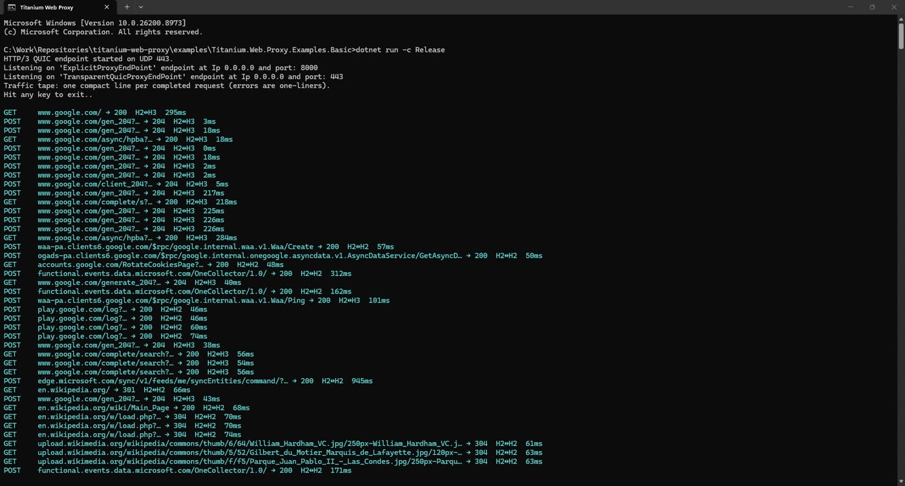
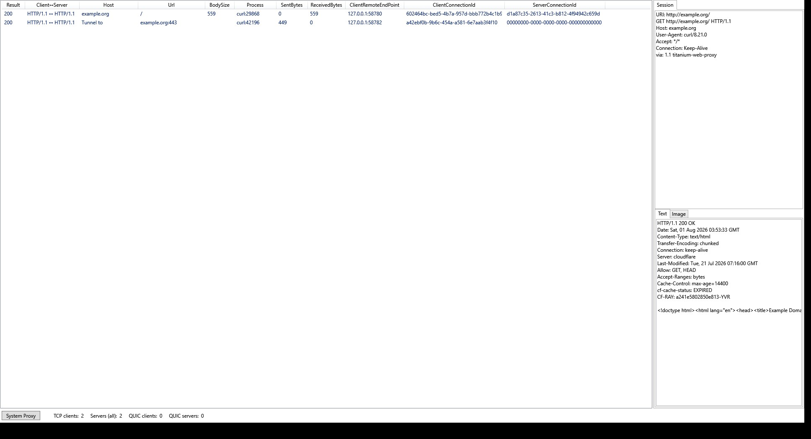

# Titanium Web Proxy

A lightweight, high performing HTTP(S) proxy server for .NET. It acts as a man in the middle (MITM) proxy and/or as a reverse proxy. Designed for high-performance. Works in Windows, Linux & Apple devices.

[](https://github.com/justcoding121/titanium-web-proxy/actions/workflows/dotnetcore.yml)
[](https://www.nuget.org/packages/Titanium.Web.Proxy)
[](https://www.nuget.org/packages/Titanium.Web.Proxy)
[](LICENSE)

## Code Quality

[](https://sonarcloud.io/summary/overall?id=justcoding121_titanium-web-proxy&branch=develop)
[](https://sonarcloud.io/summary/overall?id=justcoding121_titanium-web-proxy&branch=develop)
[](https://sonarcloud.io/summary/overall?id=justcoding121_titanium-web-proxy&branch=develop)
[](https://sonarcloud.io/summary/overall?id=justcoding121_titanium-web-proxy&branch=develop)
[](https://sonarcloud.io/summary/overall?id=justcoding121_titanium-web-proxy&branch=develop)
[](https://sonarcloud.io/summary/overall?id=justcoding121_titanium-web-proxy&branch=develop)
[](https://sonarcloud.io/summary/overall?id=justcoding121_titanium-web-proxy&branch=develop)
[](https://sonarcloud.io/summary/overall?id=justcoding121_titanium-web-proxy&branch=develop)
[](https://sonarcloud.io/summary/overall?id=justcoding121_titanium-web-proxy&branch=develop)
[](https://sonarcloud.io/summary/overall?id=justcoding121_titanium-web-proxy&branch=develop)
[](https://sonarcloud.io/summary/overall?id=justcoding121_titanium-web-proxy&branch=develop)

## Features

- Intercept, inspect, modify, redirect, or block HTTP and HTTPS traffic
- Explicit, transparent, and SOCKS4/5 proxy endpoints
- Request and response body streaming across HTTP/1.x (plain and TLS), HTTP/2, and HTTP/3 (see the [protocol support matrix](https://github.com/justcoding121/titanium-web-proxy/wiki/Protocol-Support))
- HTTP/2 support, on by default, opt-out via `ProxyServer.EnableHttp2` (see the [protocol support matrix](https://github.com/justcoding121/titanium-web-proxy/wiki/Protocol-Support) for exact coverage)
- HTTP/3 (QUIC) support, opt-in via `ProxyServer.EnableHttp3 = true` (requires MsQuic; 1xx interim responses, per-chunk body streaming hooks, upstream proxy chaining with TCP fallback, HTTPS/SVCB DNS discovery, and QPACK dynamic table; see the [HTTP/3 wiki](https://github.com/justcoding121/titanium-web-proxy/wiki/HTTP-3) for setup and the [protocol bridge matrix](https://github.com/justcoding121/titanium-web-proxy/wiki/Protocol-Support#protocol-bridges) for every client→origin direction)
- Upstream HTTP, HTTPS, and SOCKS proxies with automatic system proxy detection
- Proxy authentication, mutual TLS, Kerberos, and NTLM support
- Connection, certificate, and buffer pooling
- Built-in, zero-overhead-when-disabled logging (every caught exception, optionally to console/file or your own `ILoggerFactory`) and opt-in structured request/connection timing. See [Logging and diagnostics](https://github.com/justcoding121/titanium-web-proxy/wiki/Home#logging-and-diagnostics) in the wiki.

## Editions

| Product | What it is | License | How you get it |
|---------|------------|---------|----------------|
| **Titanium.Web.Proxy** | Core library. Embed a MITM and/or reverse proxy in your .NET app | MIT | NuGet |
| **Titanium.Cli** (`titanium` / `twp`) | Standalone reverse / edge proxy: `run`, `test`, `version`, `update` | MIT | GitHub Releases, winget, or `dotnet tool` |
| **Titanium.Plus** | Optional advanced features: control plane, ops, observability, and dashboard | [PolyForm NC](licenses/PolyForm-Noncommercial-1.0.0.txt) | GitHub Releases |
| **Titanium Inspector** | Desktop MITM debugger (session grid, inspectors, AutoResponder, breakpoints, HAR) | [PolyForm NC](licenses/PolyForm-Noncommercial-1.0.0.txt) | Windows MSI, winget, or GitHub Releases |

CLI and Plus target reverse-proxy / edge workloads (routing, load balancing, health, discovery). Inspector is the MITM debugging product; the Core library supports both modes.

## Installation

Install the stable package from [NuGet](https://www.nuget.org/packages/Titanium.Web.Proxy):

```shell
dotnet add package Titanium.Web.Proxy
```

To use the latest prerelease:

```shell
dotnet add package Titanium.Web.Proxy --prerelease
```

### CLI (`titanium` / `twp`)

Download the self-contained zip for your RID from [GitHub Releases](https://github.com/justcoding121/titanium-web-proxy/releases) (`Titanium.Cli-win-x64.zip`, etc.), extract, and run:

```shell
titanium run -c twp.yaml
titanium test -c twp.yaml
titanium version --check
titanium update
```

On Windows, the winget package id is `justcoding121.TitaniumCli`. Each zip also includes a `twp` alias binary.

Optional Plus: place `Titanium.Plus.dll` beside the CLI executable and enable Plus in config (`plus.enabled: true` with `plus.controlPlane.sharedSecret`).

### Titanium Inspector

Windows: install the MSI or portable zip from Releases, or winget id `justcoding121.TitaniumInspector`. Start interception from the Capture menu, install the root CA, then toggle system proxy.

## Supported frameworks

- .NET 10

> Versions prior to 4.0 also supported .NET Framework 4.6.2 and .NET 8; starting with 4.0, the package
> targets .NET 10 only so the codebase can take full advantage of modern APIs.

> **Breaking change:** `ProxyServer.ExceptionFunc` and `SessionEventArgsBase.TimeLine` were removed in
> favor of the unified `ProxyServer.Logging`/`EnableRequestTimingCapture` APIs described in
> [Logging and diagnostics](https://github.com/justcoding121/titanium-web-proxy/wiki/Home#logging-and-diagnostics)
> and [Breaking changes: unified logging and timing](https://github.com/justcoding121/titanium-web-proxy/wiki/Home#breaking-changes-unified-logging-and-timing).

## Quick start

The following example starts an explicit HTTP(S) proxy on `127.0.0.1:8000` and logs each requested URL:

```csharp
using System;
using System.Net;
using System.Threading.Tasks;
using Microsoft.Extensions.Logging;
using Titanium.Web.Proxy;
using Titanium.Web.Proxy.EventArguments;
using Titanium.Web.Proxy.Models;

using var proxyServer = new ProxyServer();

// Built-in console sink is a bounded channel + background writer, so LogInformation
// never blocks a session thread on Console I/O.
proxyServer.Logging.MinimumLevel = LogLevel.Information;

proxyServer.BeforeRequest += OnRequest;

var endPoint = new ExplicitProxyEndPoint(IPAddress.Loopback, 8000, decryptSsl: true);
proxyServer.AddEndPoint(endPoint);

// Create and trust the root certificate used to decrypt HTTPS traffic.
proxyServer.CertificateManager.EnsureRootCertificate(
    userTrustRootCertificate: true,
    machineTrustRootCertificate: false);

proxyServer.Start();
proxyServer.Logger.LogInformation("Proxy listening on 127.0.0.1:8000. Press Enter to stop.");
await Console.In.ReadLineAsync();
proxyServer.Stop();

Task OnRequest(object sender, SessionEventArgs e)
{
    proxyServer.Logger.LogInformation("{Url}", e.HttpClient.Request.Url);
    return Task.CompletedTask;
}
```

Configure your client to use `127.0.0.1:8000` as its HTTP and HTTPS proxy. Trusting a generated root certificate changes the current user's certificate store; only do this on a machine you control.

## Performance

Typically at or above **YARP**; ahead of **nginx** on H2/H3→H1 reverse; near parity on H1 (nginx still edges tiny keep-alive). Details: [Performance](https://github.com/justcoding121/titanium-web-proxy/wiki/Performance).

## Examples and documentation

- [Wiki](https://github.com/justcoding121/titanium-web-proxy/wiki): feature guides, including [performance measurements](https://github.com/justcoding121/titanium-web-proxy/wiki/Performance), [streaming request/response bodies](https://github.com/justcoding121/titanium-web-proxy/wiki/Streaming-Bodies), the [HTTP/3 setup guide](https://github.com/justcoding121/titanium-web-proxy/wiki/HTTP-3), and a [protocol feature support matrix](https://github.com/justcoding121/titanium-web-proxy/wiki/Protocol-Support) (what's supported for HTTP/1.x, HTTP/2, and HTTP/3, including [protocol bridges](https://github.com/justcoding121/titanium-web-proxy/wiki/Protocol-Support#protocol-bridges))
- [Basic console proxy](examples/Titanium.Web.Proxy.Examples.Basic)
- [WPF proxy application](examples/Titanium.Web.Proxy.Examples.Wpf)
- [Windows service](examples/Titanium.Web.Proxy.Examples.WindowsService)
- [Benchmarks](benchmarks/Titanium.Web.Proxy.Benchmarks): loopback throughput and allocation (BenchmarkDotNet)
- [RPS saturation probe](tools/RpsLoadProbe): concurrent breaking-point RPS
- [API documentation](https://justcoding121.github.io/titanium-web-proxy/docs/api/Titanium.Web.Proxy.ProxyServer.html)

### Screenshots

**Basic console example:** compact per-request traffic tape:



**WPF example:** session list with request/response inspection:



## Support and contributing

- Report reproducible bugs and feature requests through [GitHub Issues](https://github.com/justcoding121/Titanium-Web-Proxy/issues).
- Ask programming questions on [Stack Overflow](https://stackoverflow.com/questions/tagged/titanium-web-proxy) using the `titanium-web-proxy` tag.
- Pull requests are welcome. See [CONTRIBUTING.md](CONTRIBUTING.md).

## Maintainers

This project is actively maintained by:

- [justcoding121](https://github.com/justcoding121)

Past contributors:

- [honfika](https://github.com/honfika)

## License

Titanium Web Proxy is available under the [MIT License](LICENSE).
