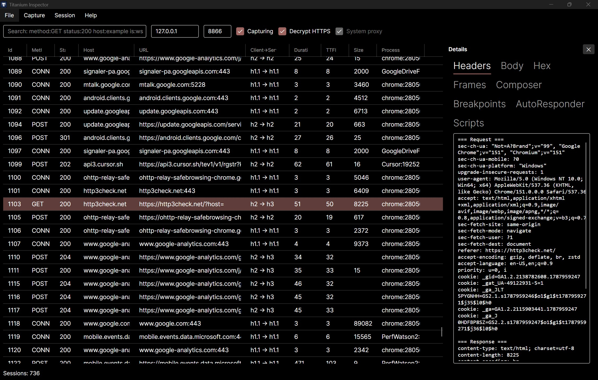

# Inspector

Desktop MITM debugger (Avalonia). Licensed under [PolyForm Noncommercial](https://github.com/justcoding121/titanium-web-proxy/blob/develop/licenses/PolyForm-Noncommercial-1.0.0.txt).



## Install

Prefer the [Download](/download) page (resolves the newest release that has Inspector assets, including prereleases).

Windows examples for the **7.0 beta** product tag:

- [MSI](https://github.com/justcoding121/titanium-web-proxy/releases/download/v7.0.0-beta/TitaniumInspector-win-x64.msi)
- [Portable zip](https://github.com/justcoding121/titanium-web-proxy/releases/download/v7.0.0-beta/TitaniumInspector-win-x64.zip)

```shell
# Stable community package only — not the 7.0 beta
winget install justcoding121.TitaniumInspector
```

## Quick use

1. Launch Inspector — by default it starts listening and enables system proxy (Capturing on).
2. Check **Decrypt HTTPS** when you want MITM (installs the root CA if needed; may prompt for admin).
3. Use the toolbar **System proxy** / **Capturing** checkboxes to pause either without quitting.

Default bind is typically `127.0.0.1:8866`. Bind address/port are **start-time** settings on the toolbar: editable when the proxy is stopped; disabled while running. Use **Start proxy** / **Stop proxy** (toolbar button or Capture menu) to switch. After Stop → Start, system proxy is turned back on if it was on before Stop, or if **Auto system proxy on start** is checked.

HTTPS stays encrypted (opaque tunnels) until **Decrypt HTTPS** is enabled.

Capture menu latching options (**Capturing**, **Decrypt HTTPS**, **System proxy**, auto-start prefs) show a check when on. Preferences such as **Session retention…**, **HTTPS sites to decrypt…**, **Ignore insecure server certificates** (off by default), and **Logging…** live under **Options**. **Reset Inspector settings…** restores preferences to factory defaults; it does not remove the root CA or clear sessions.

The status strip keeps command feedback on the left and a live **Sessions: N** count on the right, so capture traffic does not wipe tips or export paths.

**Install root CA (current user)** trusts the MITM CA on this PC. On Windows, the OS may show a Trusted Root **Yes/No** security dialog the first time that certificate is added (this is not UAC). Re-installing when the CA is already trusted does not prompt again; orphan same-name roots are cleaned up only when a new thumbprint is installed, or via **Remove** / **Rotate**. **Remove root CA** clears every same-name Titanium root in the current-user Trusted Root store (including orphans from earlier installs). **Rotate root CA…** mints a new private key, clears this install’s leaf certificate cache (next to `%AppData%\TitaniumInspector\rootCert.pfx`), removes same-name trusted roots, and prompts to reinstall trust. **Device CA setup…** opens a dialog with steps for phones/other devices and can **Export CA** from there (or use **Export root CA…** on the Capture menu).

Leaf certificates for Inspector are stored under `%AppData%\TitaniumInspector\crts\` (beside the root PFX), not under the shared `%LocalAppData%\Titanium.Web.Proxy\crts` folder used by the library default. On first start after upgrade (and on every Rotate), Inspector best-effort deletes that legacy shared `crts` folder; it never deletes a shared `rootCert.pfx`.

## Right pane: Inspect vs Tools

The right pane has two outer tabs:

| Outer tab | Purpose | Needs a selected session? |
|-----------|---------|---------------------------|
| **Inspect** | Look at one captured session | Yes (otherwise shows a hint) |
| **Tools** | Change how **all** traffic is handled | No — open via **Tools** menu |

Use **Tools → Composer / Breakpoints / AutoResponder / Scripts…** to open the pane on that tool without picking a row first. Selecting a session opens the pane on **Inspect**.

### Inspect (this session)

- **Headers** — request/response headers, cookies, query (labeled sections)
- **Body** — request and response bodies as `=== Request ===` / `=== Response ===` (decoded / JSON when possible; `(empty)` if missing)
- **Hex** — same labeled sections for raw bytes
- **WS Frames** — shown **only for WebSocket** sessions; best-effort text preview of messages (not a full opcode stream)

Search for WebSocket traffic with `is:ws`. Quick filters on the toolbar toggle `hide:tunnel`, `hide:image`, and `is:error` into the same search box. Status classes (`status:2xx` … `status:5xx`), `process:`, and `content-type:` are also supported. The status strip shows **Sessions: N** with no filter, and **visible / total** when a search or quick filter is active.

### Tools (all traffic)

Pipeline order on each request:

**Scripts → AutoResponder → Breakpoints → origin**

#### Composer

Build and send a request through the proxy. **Load from selected** copies method/URL/headers/body from the current session.

#### Breakpoints

Pause matching requests (URL glob; `*` = all) so you can edit the body, **Continue**, or **Abort** (403). At most one pause at a time; unmatched overflow auto-continues; pauses time out after **120 seconds**. Optional **Break on response**.

#### AutoResponder

If **Enabled**, the first matching rule returns a fake status/body **before** the real server (and before breakpoints). Match URLs with `*` wildcards.

#### Scripts

**Not JavaScript or C#.** One directive per line (comments with `#` or `//`):

```text
set-header X-Debug: 1
set-status 404
abort
```

Applies to every captured request/response. On request, `abort` or `set-status` short-circuits AutoResponder, breakpoints, and the origin.


## Platform matrix (system proxy and root CA)

| Feature | Windows | macOS | Linux |
|---------|---------|-------|-------|
| System proxy | WinINET (automatic) | `networksetup` (admin prompt if required) | GNOME `gsettings` + KDE + process `http(s)_proxy` |
| Root CA user trust | Current-user Root store | Login keychain (`security`) + .NET store | .NET store + user NSS (`certutil`, Chromium) |
| Root CA machine / admin | UAC + `certutil` | System keychain (macOS auth dialog) | `pkexec` + `update-ca-certificates` |
| Cancel elevation | Leaves settings unchanged | Leaves settings unchanged | Leaves settings unchanged |

Notes:

- Headless Linux without polkit/GUI cannot show an admin dialog; use Export CA and install manually.
- Firefox may require trusting the CA in its own certificate store.
- KDE proxy reload is best-effort; a session restart may be needed if apps do not pick up changes.
- If user-level CA install fails, Inspector offers an elevated retry (OS admin prompt).
## Other features

- Session grid: method, status, host, URL, Protocol, duration, Wait (TTFB), size, process. Right-click menu: Replay, Load into Composer, Export selected HAR/archive, Copy URL.
- HAR / archive: Export all writes every captured session; Export selected writes the grid multi-selection. Import appends sessions from the file. Replay selected session.
- System proxy and root CA install / untrust / export; Device CA setup dialog for external devices; **Allow Store apps…** on Windows
- Search (`method:GET status:2xx host:example process:chrome is:ws hide:tunnel`); quick filters: Hide CONNECT, Hide images, Errors only
- Optional Plus panels when `Titanium.Plus.dll` is present

## See also

- [Download](/download)
- [Editions](/docs/editions)
- [Library](/docs/library) for embedding the same engine
