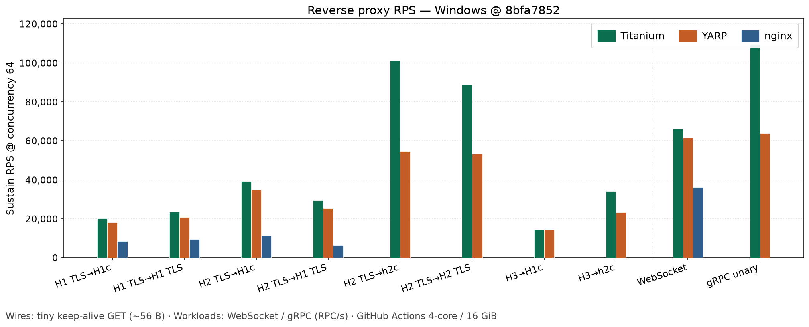
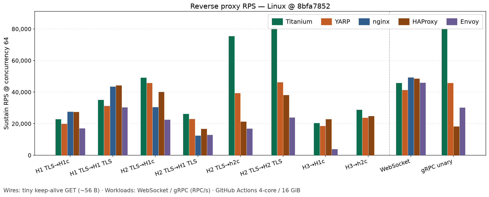
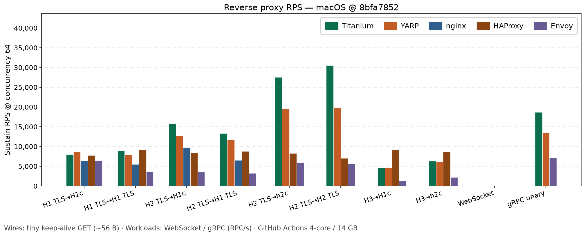
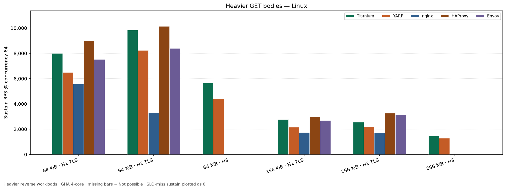
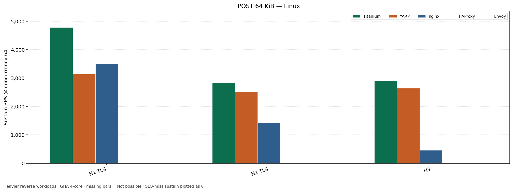
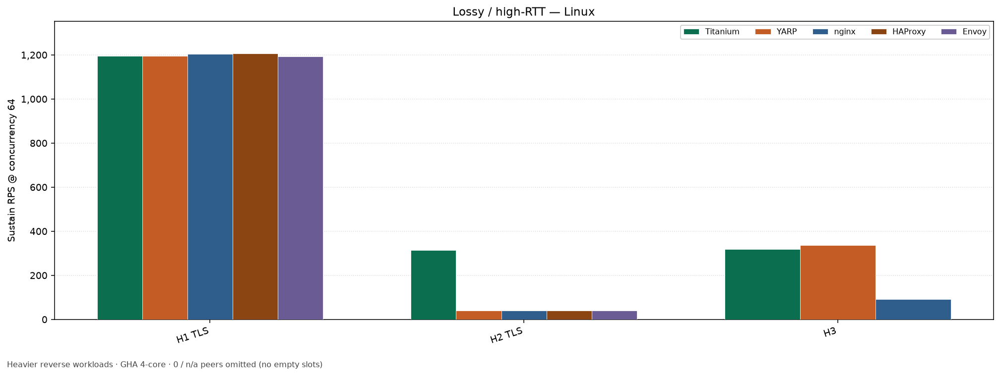
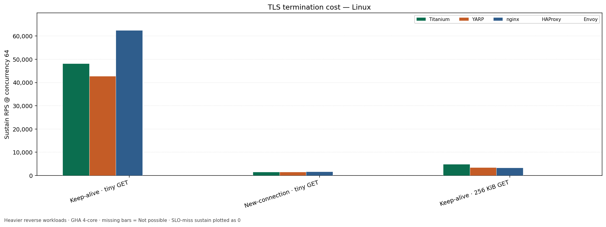
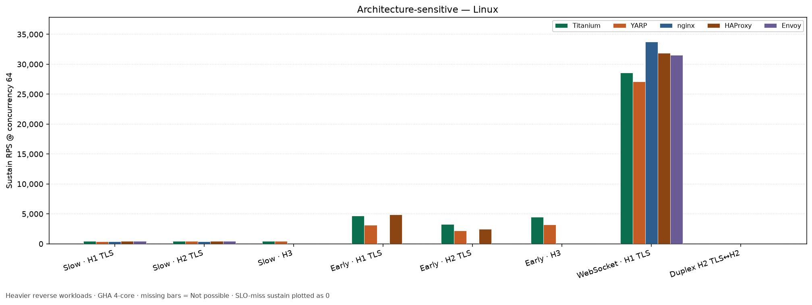

# Performance

Titanium targets low-overhead man-in-the-middle (MITM) and reverse proxying: connection pooling, HTTP/2 multiplexing, and buffer reuse.

## Summary (from publishable CI tables)

On matched **GitHub Actions 4 vCPU / 16 GiB** runners, compare **TWP÷YARP** (gated ≥ **0.70** reverse) and peer ratios vs **nginx**, **HAProxy**, and **Envoy** on the same loopback harness. MITM is Titanium-only among those peers (they cannot MITM). Absolute requests per second (RPS) varies by OS, TLS, and MsQuic packaging — compare **within a table**, not across Windows vs Linux.

## Practical reverse RPS (CI)

Sustain RPS @ concurrency 64 — **10 clusters** per OS: seven industry reverse wires (tiny keep-alive GET) plus POST 64 KiB / WebSocket / unary gRPC (RPC/s). Wires: H1 TLS→H1c · H1 TLS→H1 TLS · H2 TLS→H1c · H2 TLS→H1 TLS · H2 TLS→h2c · H2 TLS→H2 TLS · H3→H1c. Grouped bars: Titanium / YARP / nginx / HAProxy / Envoy. Missing bars mean *Not possible* / n/a for that wire or OS (e.g. Windows HAProxy/Envoy, nginx without H2/H3 upstream). Do not compare absolute RPS across clusters (shards). Regenerate with [`render-practical-charts.py`](https://github.com/justcoding121/titanium-web-proxy/blob/develop/tools/RpsLoadProbe/render-practical-charts.py) after `compare-product` plus `--post-root` / `--arch-root` / `--grpc-root` (union sharded CSV roots when `arm_shard` was used).

### Windows



### Linux



### macOS



## Heavier reverse workloads

Real-world shapes from independent GHA dispatches (`compare-bodies`, `compare-post`, `compare-lossy`, `compare-tls-cost`, `compare-arch`). Linux charts below; Windows tables and charts on the [Performance wiki](https://github.com/justcoding121/titanium-web-proxy/wiki/Performance#heavier-reverse-workloads).











Regenerate with [`render-heavier-charts.py`](https://github.com/justcoding121/titanium-web-proxy/blob/develop/tools/RpsLoadProbe/render-heavier-charts.py).

## Full measurements

Detailed tables, harness knobs, and methodology live in the project wiki:

- [Performance wiki](https://github.com/justcoding121/titanium-web-proxy/wiki/Performance)
- [Performance profiling](https://github.com/justcoding121/titanium-web-proxy/wiki/Performance-Profiling)
- Local cool A/B lab (not publishable): [Performance Local Lab](https://github.com/justcoding121/titanium-web-proxy/wiki/Performance-Local-Lab)

Harness: [`tools/RpsLoadProbe`](https://github.com/justcoding121/titanium-web-proxy/tree/develop/tools/RpsLoadProbe) and [PERF-GATES.md](https://github.com/justcoding121/titanium-web-proxy/blob/develop/tools/RpsLoadProbe/PERF-GATES.md).

### Feature cost notes

- **gRPC-JSON transcoding** (Plus): when unset, Core pays only a null check. When enabled, the process uses the session interception path and buffers matched unary bodies — do not enable it on default RPS edition arms. Details: [gRPC-JSON transcoding](/docs/grpc-json-transcoding).

```powershell
pwsh tools/RpsLoadProbe/run-rps.ps1 -Mode compare-saturation
```
