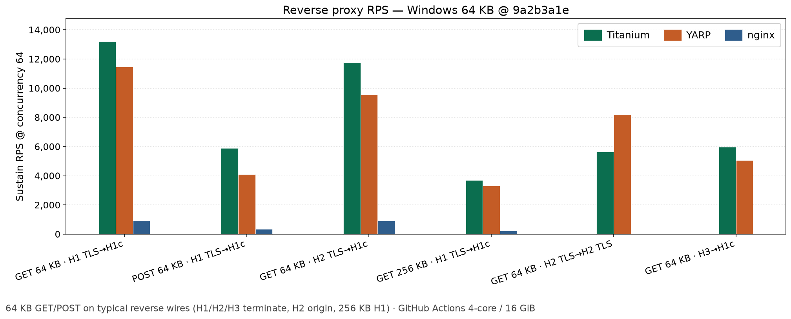
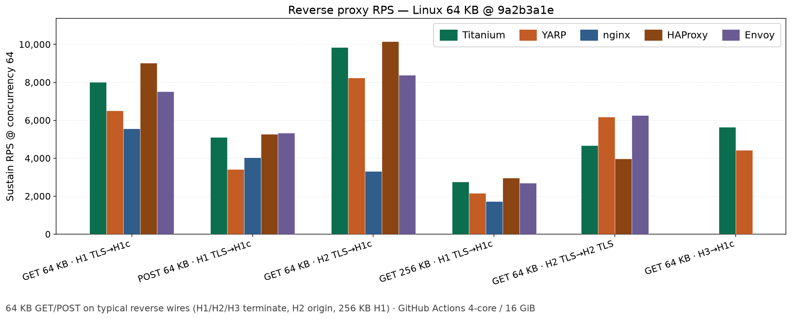

# Performance

Titanium targets low-overhead reverse proxying and HTTPS interception: connection pooling, HTTP/2 multiplexing, and buffer reuse.

**RPS** is requests per second. gRPC bars are **RPC/s** (unary calls). Read **within** a chart (same OS), not Windows vs Linux as one number. Missing bars mean that peer cannot run that wire on that OS.

## Practical reverse RPS (tiny requests)

Common reverse wires with **tiny keep-alive GET (~56 B)**, plus WebSocket and unary gRPC — one chart per OS. How to read medals and workload shape: [Performance wiki](https://github.com/justcoding121/titanium-web-proxy/wiki/Performance#why-this-comparison-is-fair).

### Windows

### Linux

### macOS

## Practical reverse RPS (64 KB)

Typical reverse wires with **64 KB GET/POST** (plus 256 KB H1 terminate) — body work separate from the tiny-GET chart above. Windows and Linux below; macOS heavier bodies are not published yet.

### Windows

### Linux

## Heavier reverse workloads

Larger bodies, POST, lossy links, TLS termination cost, and architecture-sensitive shapes (slow consumers, duplex, WebSocket H1 Upgrade). Full tables are on the [Performance wiki](https://github.com/justcoding121/titanium-web-proxy/wiki/Performance#heavier-reverse-workloads).

Additional real-world tables (wiki only, not plotted here): [Unary gRPC H2→h2c](https://github.com/justcoding121/titanium-web-proxy/wiki/Performance#unary-grpc-h2-tls--h2c), [WebSocket H1 TLS→H1 TLS](https://github.com/justcoding121/titanium-web-proxy/wiki/Performance#websocket-h1-tls--h1-tls), [WebSocket RFC 8441](https://github.com/justcoding121/titanium-web-proxy/wiki/Performance#websocket-h2-tls-8441--h1).

## Full measurements

Product 5×5 reverse/MITM matrices, saturation calibration, heavier reverse (bodies/POST/lossy/TLS/arch), unary gRPC (H2↔H2 and H2→h2c), and WebSocket (H1 Upgrade, dual-TLS H1, RFC 8441 H2) tables live on the [Performance wiki](https://github.com/justcoding121/titanium-web-proxy/wiki/Performance). Profiling notes: [Performance profiling](https://github.com/justcoding121/titanium-web-proxy/wiki/Performance-Profiling).

---

*How we measure:* matched GitHub Actions runners (~4 vCPU / 16 GiB) on Windows, Linux, and macOS; Titanium vs YARP, nginx, HAProxy, and Envoy; same client, origin, warmup, duration, and concurrency (sustain at 64). Absolute RPS varies slightly with runner noise.
