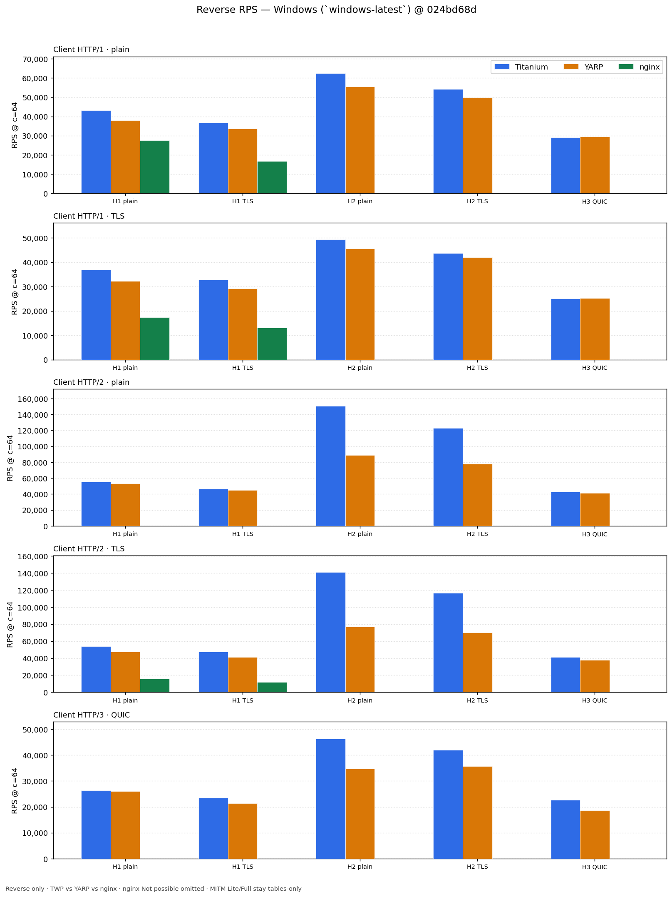
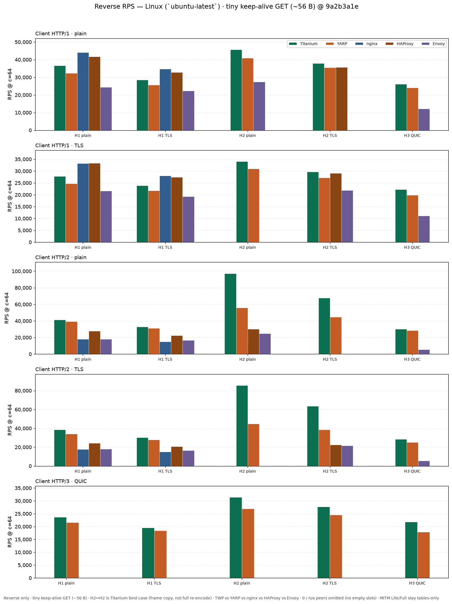
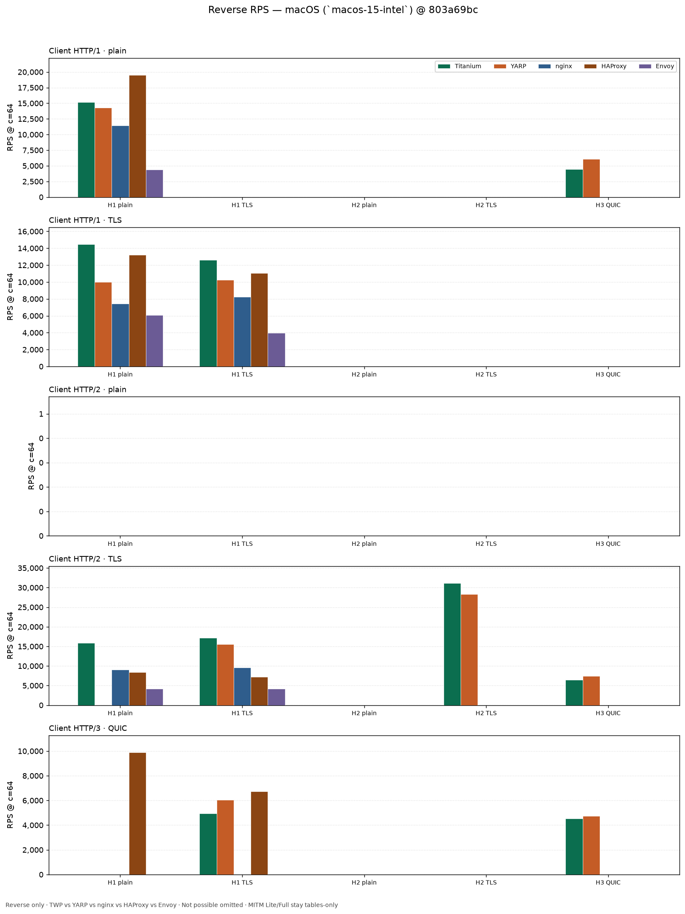
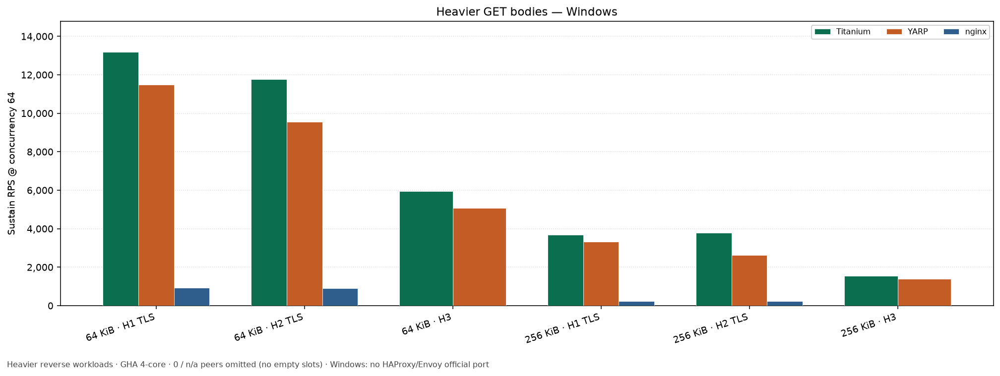
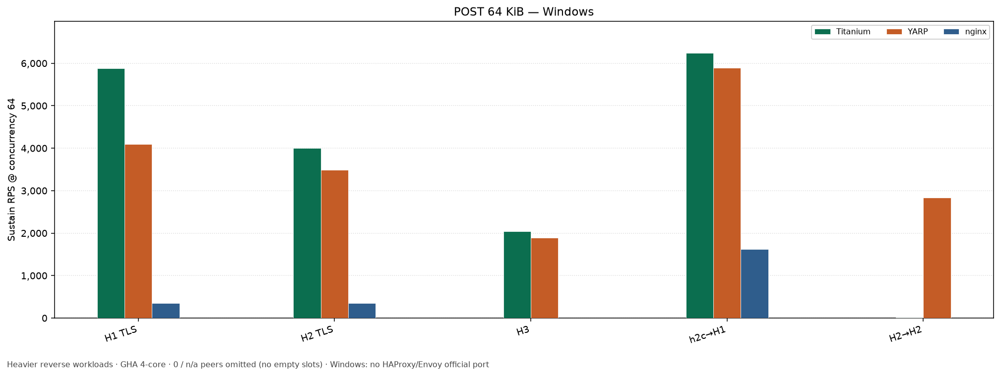
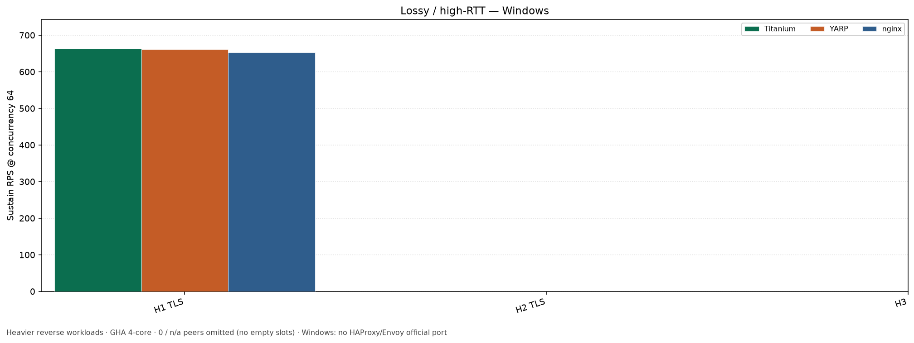
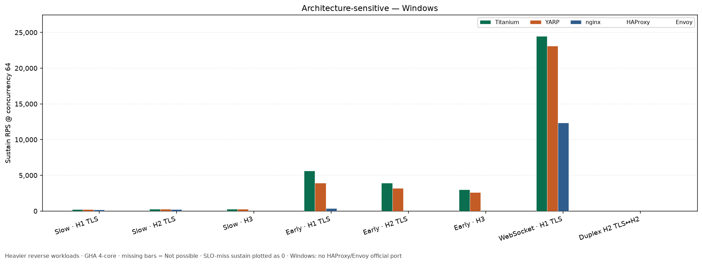
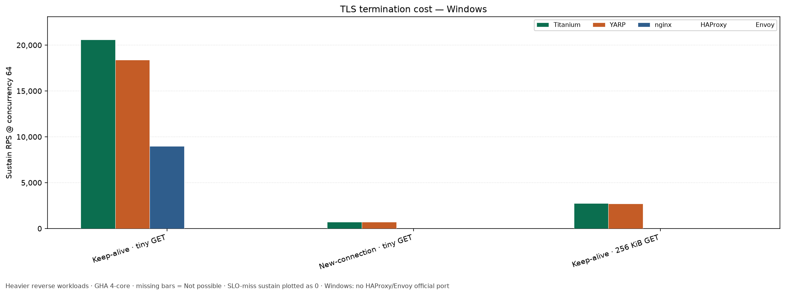

# Performance

## Why this comparison is fair

These tables are a **same-harness, same-origin, same-runner-class** reverse-proxy comparison — not a blog-post bake-off of mismatched labs.

- **Same load generator** (`dotnet-httpclient`), **same origin process**, **same warmup/measure** (2s / 8s), **same concurrency ramp** (8, 16, 32, 64), **median of 3** GitHub Actions repeats **inside one shard job**.
- Every reverse arm is **three OS processes** (load generator + origin child + proxy child). Origin-direct omits the proxy. Peers are never in-process with the client.
- **Same runner class per table**: `windows-latest` / `ubuntu-latest` / `macos-15-intel` (4-core-class). Laptop High-perf and `macos-latest` are never mixed into these tables.
- **One wiki row = one GHA job**: TWP + YARP + nginx + HAProxy + Envoy (when the OS can run them) + TWP Lite + Full for that Client×Origin stay on the **same VM**. Shards split **rows**, not individual proxies — so **TWP÷YARP** and **Lite÷Reverse** remain same-job ratios. Do not compare **absolute** RPS across shards (different VMs).
- **YARP** is `Yarp.ReverseProxy` **2.3.0** with equivalent TLS/ALPN. **nginx** uses streaming knobs (`keepalive 256`, buffering off). **HAProxy** (GPL v2 Community) and **Envoy** (Apache 2.0) are open-source terminate peers on the same loopback shape — Linux/macOS only; Windows cells are *Not possible* (no official HAProxy port; Envoy Windows support discontinued). Fair knobs: HAProxy `http-reuse aggressive`, `maxconn 256`, `nbthread`=CPU; Envoy `concurrency`=CPU, cluster limits ~256, no access log, upstream TLS verify off for loopback CA. Linux nginx (mainline + `http_v3`) is authoritative; Windows nginx has no QUIC — those cells are *Not possible*, not losses.
- **MITM is TWP-only** (CONNECT + forged certs). nginx/YARP cannot MITM; Lite/Full tables are overhead vs TWP reverse, not vs peers. There are **no MITM charts**.
- The product signal is **TWP÷YARP** (gated ≥ **0.70** reverse) and **MITM÷Reverse** (Lite ≥ **0.50**, Full ≥ **0.50**), not absolute RPS. nginx / HAProxy / Envoy are **wiki and chart peers only** — no CI gate. Absolute RPS moves with runner heat; ratios are the claim.
- Product fast paths (session-lite, skip-poll, compressed relay) are **in-tree defaults** for interception-off reverse — the same class of work YARP/nginx do. The harness does not disable TWP safety that peers also skip, and it does not retune to pass gates ([PERF-GATES.md](https://github.com/justcoding121/titanium-web-proxy/blob/develop/tools/RpsLoadProbe/PERF-GATES.md)).
- **MITM leaf keys** are a shared RSA/ECDSA pair per `CertificateManager` (one key for all forged leaves). That is an intentional RPS tradeoff: compromise of that material affects every host minted by that manager. Reverse/YARP/nginx paths do not mint leaves.

Numbers below are **Release** measurements with [RpsLoadProbe](https://github.com/justcoding121/titanium-web-proxy/tree/develop/tools/RpsLoadProbe). Native terminate peers: **nginx**, **HAProxy**, **Envoy** (where the OS supports them).

For pooling knobs and certificate first-visit tuning, see [Performance and pooling](Home#performance-and-pooling). For the local cool A/B lab, laptop tables, and profiling notes, see [Performance Profiling](Performance-Profiling).

## Contents

- [Measurement environment](#measurement-environment)
    - [Windows (GitHub-hosted `windows-latest`)](#windows-github-hosted-windows-latest)
    - [Linux (GitHub-hosted `ubuntu-latest`)](#linux-github-hosted-ubuntu-latest)
    - [macOS (GitHub-hosted `macos-15-intel`)](#macos-github-hosted-macos-15-intel)
    - [Tiered cadence](#tiered-cadence)
    - [Arm shards (comparison groups)](#arm-shards-comparison-groups)
    - [Saturation control](#saturation-control)
- [Windows — Titanium vs nginx vs HAProxy vs Envoy vs YARP](#windows--titanium-vs-nginx-vs-haproxy-vs-envoy-vs-yarp)
- [Linux — Titanium vs nginx vs HAProxy vs Envoy vs YARP](#linux--titanium-vs-nginx-vs-haproxy-vs-envoy-vs-yarp)
    - [Tiny JSON reverse is nginx’s best case on Linux](#tiny-json-reverse-is-nginxs-best-case-on-linux)
    - [Why isn’t HTTP/3 > HTTP/2 > HTTP/1 in raw RPS?](#why-isnt-http3--http2--http1-in-raw-rps)
- [macOS — Titanium vs nginx vs HAProxy vs Envoy vs YARP](#macos--titanium-vs-nginx-vs-haproxy-vs-envoy-vs-yarp)
    - [Reverse](#reverse-2)
    - [MITM (TWP only)](#mitm-twp-only-2)
- [Editions (CLI / Plus / Intercept)](#editions-cli--plus--intercept)
- [Cross-version (7.0 vs 6.0)](#cross-version-70-vs-60)
- [Heavier reverse workloads](#heavier-reverse-workloads)
    - [Windows — heavier reverse GET (64 KiB / 256 KiB)](#windows--heavier-reverse-get-64-kib--256-kib)
    - [Linux — heavier reverse GET (64 KiB / 256 KiB)](#linux--heavier-reverse-get-64-kib--256-kib)
    - [Windows — POST 64 KiB request + 64 KiB response](#windows--post-64-kib-request--64-kib-response)
    - [Linux — POST 64 KiB request + 64 KiB response](#linux--post-64-kib-request--64-kib-response)
    - [Windows — lossy / high-RTT (H2 HOL / H3 loss)](#windows--lossy--high-rtt-h2-hol--h3-loss)
    - [Linux — lossy / high-RTT (H2 HOL / H3 loss)](#linux--lossy--high-rtt-h2-hol--h3-loss)
    - [Architecture-sensitive](#architecture-sensitive)
    - [TLS termination cost (H1 TLS → cleartext origin)](#tls-termination-cost-h1-tls--cleartext-origin)
- [Other measurements](#other-measurements)
- [Raising limits on large hosts](#raising-limits-on-large-hosts)

## Measurement environment

All three OS use the **4-core-class** public-repo GitHub-hosted runners: **Windows / Linux** at **4 vCPU / 16 GiB / 14 GB SSD**, **macOS** at **`macos-15-intel` 4-core / 14 GB** (not `macos-latest`). Same harness knobs (`workflow_dispatch` [RPS saturation](https://github.com/justcoding121/titanium-web-proxy/actions/workflows/rps-saturation.yml): warmup 2s / measure 8s; concurrency 8, 16, 32, 64; median of 3 repeats **inside each shard**; `--stop-on-slo-fail` default on). Hosted jobs hard-cap at **360 minutes** (ramp step **345**; smokes **120**). Every `--ramp` arm is **three OS processes** (parent load generator + origin child + proxy child), except **origin-direct** arms (load gen + origin only). Prefer **TWP÷YARP** / **TWP÷nginx** ratios over absolute RPS.

Laptop High-perf / cool-paired Windows numbers live on [Performance Local Lab](Performance-Local-Lab). Do not mix those absolutes into the tables below.

### Tiered cadence

| Tier | Mode | When |
|------|------|------|
| Daily / per-PR | `compare-spot` | minutes |
| Milestone | `compare-terminate` / `compare-matrix` | ~1–2h |
| Editions | `compare-editions` | ~60 min (CLI / Plus / Intercept stress arms) |
| Cross-version (Gate 2) | `compare-cross-version` | ~1–2h vs committed 6.0 baselines |
| Pre-wiki smoke | `compare-product-smoke` (Linux 2 shards, `repeats=1`) | ~30–60 min; required before full product |
| Release / wiki | `compare-product` (**3** comparison-group shards × Win/Linux/mac) | ~2–2½h wall (Free account queues beyond 20 jobs) |
| Unary gRPC | `compare-grpc` | Win/Linux/mac; RPC/s @ c=64 |
| Heavier tables | `compare-bodies` (**2** shards) / `post` / `lossy` / `arch` (**3** shards) / `tls-cost` | dispatch independently |

See [PERF-GATES.md](https://github.com/justcoding121/titanium-web-proxy/blob/develop/tools/RpsLoadProbe/PERF-GATES.md).

### Arm shards (comparison groups)

`--arm-shard i/n` (workflow input `arm_shard`) partitions **wiki rows** (Client×Origin + heavier/arch workload suffix), not individual proxy arms. Paste unions shard CSVs (`paste-compare-product-wiki.ps1 -RunIds …`; heavier `RUNS` lists). Table “Source: Actions” may list several run URLs for one table — **do not mix SHAs**. Free GitHub accounts allow **20** concurrent jobs (~34 for a full suite); extras **queue**, they do not fail. Dispatch product (and cross-version) first when wall clock matters.

### Windows (GitHub-hosted `windows-latest`)

| | |
|---|---|
| OS | Windows Server (GitHub-hosted `windows-latest`) |
| CPU | **4** logical processors |
| RAM | **16** GiB |
| Runtime | .NET 10.0.x |
| nginx | nginx/Windows **1.31.3** (same-OS only; no QUIC) |
| HAProxy | *Not possible* on Windows (no official port) |
| Envoy | *Not possible* on Windows (upstream discontinued Windows builds) |
| YARP | Yarp.ReverseProxy **2.3.0** |
| Harness | RpsLoadProbe Release; median of 3 repeats |

### Linux (GitHub-hosted `ubuntu-latest`)

| | |
|---|---|
| OS | Ubuntu 24.04.x LTS |
| CPU | **4** logical processors (AMD EPYC; runners this pass were 7763 / 9V74) |
| RAM | **16** GiB |
| Runtime | .NET 10.0.11 |
| nginx | nginx/**1.31.4** (nginx.org mainline, `--with-http_v3_module`) |
| HAProxy | HAProxy **3.2.23** built with `USE_QUIC` (GHA; Ubuntu distro 2.8 is not QUIC-capable) |
| Envoy | pinned GitHub release static binary **1.36.7** (HTTP/3 compiled in) |
| YARP | Yarp.ReverseProxy **2.3.0** |
| Harness | RpsLoadProbe Release; median of 3 repeats where noted |

### macOS (GitHub-hosted `macos-15-intel`)

| | |
|---|---|
| OS | macOS 15 (GitHub-hosted `macos-15-intel`, Intel x86_64) |
| CPU | **4** logical processors |
| RAM | **14** GB |
| Runtime | .NET 10.0.x |
| nginx | Homebrew nginx with `--with-http_v3_module` (workflow fails if missing) |
| HAProxy | Homebrew `haproxy` with `USE_QUIC` (workflow fails if missing; 3.2.23 osx source fallback) |
| Envoy | Homebrew bottle when present; else pinned darwin-amd64 **1.36.7** (official GitHub assets are Linux-only). HTTP/3 compiled in. |
| MsQuic | Homebrew `libmsquic` + `openssl@3` on `DYLD_LIBRARY_PATH` / `DYLD_FALLBACK_LIBRARY_PATH` (`QuicListener.IsSupported`) |
| YARP | Yarp.ReverseProxy **2.3.0** |
| Harness | RpsLoadProbe Release; median of 3 repeats where noted |

Do **not** use `macos-latest` (Apple Silicon, 3-core / 7 GB) for publishable saturation numbers.

### Saturation control

Calibration for the shared 4 vCPU loopback shape: how close client + origin are to saturated before ranking reverse peers. Tiny keep-alive GET. Median of **3** repeats @ `803a69bc` — [34394853191](https://github.com/justcoding121/titanium-web-proxy/actions/runs/34394853191). Warmup 2s / measure 8s; concurrency 8, 16, 32, 64. Block A **% of origin-HttpClient** uses median **peak** RPS. Blocks B/C use peer÷YARP / ÷nginx on median peak (not % of H1 origin). **RPS cells** embed median RSS / CPU for the **proxy child** plus its **full descendant tree** (serve-proxy → nginx master → workers); origin-direct samples the **origin** child. Product matrices below use matched `dotnet-httpclient` only (not bombardier).


```powershell
pwsh tools/RpsLoadProbe/run-rps.ps1 -Mode compare-saturation
```

#### Block A — H1 plain

| Arm | Generator | Notes |
|---|---|---|
| `origin-direct` | `dotnet-httpclient` | No proxy — origin ceiling under the same client used for publishable ratios |
| `origin-direct-bombardier` | `bombardier` | External client check (CI installs bombardier) |
| `bare-reverse-http1` | `dotnet-httpclient` | Thin C# H1 reverse (`BareHttp1ReverseProxy`) — .NET runtime / loopback ceiling for a three-process reverse hop; **not** a product peer |
| `nginx-reverse-http1` / `yarp-reverse-http1` / `twp-reverse-http1` | `dotnet-httpclient` | Product peers (medals among these three only) |

**Windows** (`windows-latest`)

| Arm | Generator | Sustain | Peak | % of origin-HttpClient |
|---|---|---:|---:|---:|
| origin-direct | dotnet-httpclient | **63,571**<br><sub>(55 MiB / 42.1% CPU)</sub> | **63,571**<br><sub>(55 MiB / 42.1% CPU)</sub> | **100.0%** |
| origin-direct-bombardier | bombardier | **48,794**<br><sub>(56 MiB / 24.8% CPU)</sub> | **48,794**<br><sub>(56 MiB / 24.8% CPU)</sub> | **76.8%** |
| bare-reverse-http1 | dotnet-httpclient | **31,458**<br><sub>(57 MiB / 45.7% CPU)</sub> | **31,458**<br><sub>(57 MiB / 45.7% CPU)</sub> | **49.5%** |
| nginx-reverse-http1 | dotnet-httpclient | **19,660**<br><sub>(125 MiB / 24.9% CPU)</sub> | **19,660**<br><sub>(125 MiB / 24.9% CPU)</sub> | **30.9%** |
| yarp-reverse-http1 | dotnet-httpclient | **27,402**<br><sub>(91 MiB / 49.8% CPU)</sub> | **27,402**<br><sub>(91 MiB / 49.8% CPU)</sub> | **43.1%** |
| twp-reverse-http1 | dotnet-httpclient | 🥇 **31,891**<br><sub>(73 MiB / 48.5% CPU)</sub> | **31,891**<br><sub>(73 MiB / 48.5% CPU)</sub> | **50.2%** |

**Linux** (`ubuntu-latest`)

| Arm | Generator | Sustain | Peak | % of origin-HttpClient |
|---|---|---:|---:|---:|
| origin-direct | dotnet-httpclient | **71,840**<br><sub>(80 MiB / 42.0% CPU)</sub> | **71,840**<br><sub>(80 MiB / 42.0% CPU)</sub> | **100.0%** |
| origin-direct-bombardier | bombardier | **43,758**<br><sub>(80 MiB / 35.4% CPU)</sub> | **43,758**<br><sub>(80 MiB / 35.4% CPU)</sub> | **60.9%** |
| bare-reverse-http1 | dotnet-httpclient | **33,382**<br><sub>(70 MiB / 45.0% CPU)</sub> | **33,382**<br><sub>(70 MiB / 45.0% CPU)</sub> | **46.5%** |
| nginx-reverse-http1 | dotnet-httpclient | 🥇 **39,834**<br><sub>(75 MiB / 40.7% CPU)</sub> | **39,834**<br><sub>(75 MiB / 40.7% CPU)</sub> | **55.4%** |
| yarp-reverse-http1 | dotnet-httpclient | **28,584**<br><sub>(115 MiB / 50.6% CPU)</sub> | **28,584**<br><sub>(115 MiB / 50.6% CPU)</sub> | **39.8%** |
| twp-reverse-http1 | dotnet-httpclient | **33,681**<br><sub>(89 MiB / 50.7% CPU)</sub> | **33,681**<br><sub>(89 MiB / 50.7% CPU)</sub> | **46.9%** |

Reverse peers are about **50–46%** of the origin-direct HttpClient peak on this runner class (Win TWP **50.0%**, Lin TWP **45.6%**). Prefer the **%** column over absolute RPS across runs. Bare and origin-direct are controls (not medal peers).

#### Block B — H2 TLS→H1

Peer ratios (÷YARP / ÷nginx) on median peak; **RPS cells** embed `(MiB / CPU%)`.

**Windows** (`windows-latest`)

| Arm | Generator | Sustain | Peak | ÷YARP | ÷nginx |
|---|---|---:|---:|---:|---:|
| nginx-reverse-http2 | dotnet-httpclient | **11,563**<br><sub>(141 MiB / 24.3% CPU)</sub> | **11,563**<br><sub>(141 MiB / 24.3% CPU)</sub> | **0.33×** | **1.00×** |
| yarp-reverse-http2 | dotnet-httpclient | **35,473**<br><sub>(91 MiB / 53.0% CPU)</sub> | **35,473**<br><sub>(91 MiB / 53.0% CPU)</sub> | **1.00×** | **3.07×** |
| twp-reverse-http2-cleartext | dotnet-httpclient | 🥇 **40,219**<br><sub>(105 MiB / 52.9% CPU)</sub> | **40,219**<br><sub>(105 MiB / 52.9% CPU)</sub> | **1.13×** | **3.48×** |

**Linux** (`ubuntu-latest`)

| Arm | Generator | Sustain | Peak | ÷YARP | ÷nginx |
|---|---|---:|---:|---:|---:|
| nginx-reverse-http2 | dotnet-httpclient | **15,477**<br><sub>(100 MiB / 19.4% CPU)</sub> | **15,477**<br><sub>(100 MiB / 19.4% CPU)</sub> | **0.52×** | **1.00×** |
| yarp-reverse-http2 | dotnet-httpclient | **29,740**<br><sub>(122 MiB / 50.1% CPU)</sub> | **29,740**<br><sub>(122 MiB / 50.1% CPU)</sub> | **1.00×** | **1.92×** |
| twp-reverse-http2-cleartext | dotnet-httpclient | 🥇 **34,805**<br><sub>(115 MiB / 53.0% CPU)</sub> | **34,805**<br><sub>(115 MiB / 53.0% CPU)</sub> | **1.17×** | **2.25×** |

#### Block C — H3→H1

Same layout as Block B. Requires QuicListener. nginx needs `http_v3_module` (Windows nginx has no QUIC). HAProxy needs `USE_QUIC` (GHA Linux/macOS require it). Envoy 1.20+ includes HTTP/3.

**Windows** (`windows-latest`)

| Arm | Generator | Sustain | Peak | ÷YARP | ÷nginx |
|---|---|---:|---:|---:|---:|
| nginx-reverse-http3-cleartext | dotnet-httpclient | *Not possible (no QUIC)* | *Not possible (no QUIC)* | — | — |
| yarp-reverse-http3-cleartext | dotnet-httpclient | **17,560**<br><sub>(159 MiB / 48.2% CPU)</sub> | **17,560**<br><sub>(159 MiB / 48.2% CPU)</sub> | **1.00×** | — |
| twp-reverse-http3-cleartext | dotnet-httpclient | 🥇 **19,686**<br><sub>(108 MiB / 43.9% CPU)</sub> | **19,686**<br><sub>(108 MiB / 43.9% CPU)</sub> | **1.12×** | — |

**Linux** (`ubuntu-latest`)

| Arm | Generator | Sustain | Peak | ÷YARP | ÷nginx |
|---|---|---:|---:|---:|---:|
| nginx-reverse-http3-cleartext | dotnet-httpclient | **0**<br><sub>(106 MiB / 22.7% CPU)</sub> | **15,453**<br><sub>(106 MiB / 22.7% CPU)</sub> | **0.81×** | **1.00×** |
| yarp-reverse-http3-cleartext | dotnet-httpclient | **19,089**<br><sub>(183 MiB / 50.6% CPU)</sub> | **19,089**<br><sub>(183 MiB / 50.6% CPU)</sub> | **1.00×** | **1.24×** |
| twp-reverse-http3-cleartext | dotnet-httpclient | 🥇 **21,267**<br><sub>(146 MiB / 50.8% CPU)</sub> | **21,267**<br><sub>(146 MiB / 50.8% CPU)</sub> | **1.11×** | **1.38×** |

**How to read the tables**

- **Reverse** = bare transparent fixed-forward (no TWP plugins / interception). nginx knobs match TWP/YARP streaming (`keepalive 256`, `proxy_buffering off`). **MITM** = TWP-only table on the same Client×Origin wires: **Lite** = no-op handlers (unchanged-lite finish reuses reverse compressed relay); **Full** = mutating handlers that append up to four unique headers per direction (RPS harness adds one; product uses `MitmCompressedRelayHelper` — no probe name in library code). Remove/replace/non-unique header growth and body mutation still force full decode/re-encode. nginx/YARP cannot MITM. **HTTP/3 has no cleartext client** (QUIC always encrypted).
- **Sustainable** = last concurrency that still met error/latency SLOs. **Peak** = highest RPS in that ramp.
- 🥇 = best among **TWP / nginx / YARP** on Reverse rows (or saturation blocks): highest RPS; on an RPS tie, lower Memory (RSS) then lower CPU%. MITM is TWP-only. **Lite÷Reverse** / **Full÷Reverse** = TWP MITM lite or full sustain ÷ TWP Reverse sustain on the same Client×Origin from the same `compare-product` job.
- *Not possible* = product cannot do that path. *Not measured* = path exists but no published number yet for that OS.
- Product refresh: `compare-product` @ `803a69bc` — [34394847149](https://github.com/justcoding121/titanium-web-proxy/actions/runs/34394847149) (Win/Linux) + [34400795387](https://github.com/justcoding121/titanium-web-proxy/actions/runs/34400795387) (macOS). Heavier/saturation/tls:

```powershell
pwsh tools/RpsLoadProbe/run-rps.ps1 -Mode compare-product
pwsh tools/RpsLoadProbe/run-rps.ps1 -Mode compare-bodies
pwsh tools/RpsLoadProbe/run-rps.ps1 -Mode compare-post
pwsh tools/RpsLoadProbe/run-rps.ps1 -Mode compare-lossy
pwsh tools/RpsLoadProbe/run-rps.ps1 -Mode compare-tls-cost
pwsh tools/RpsLoadProbe/run-rps.ps1 -Mode compare-arch
pwsh tools/RpsLoadProbe/run-rps.ps1 -Mode compare-saturation
```

## Windows — Titanium vs nginx vs HAProxy vs Envoy vs YARP

Client / origin: HTTP version and whether TLS is used (`plain` = cleartext, `TLS` = encrypted, `QUIC` = HTTP/3).

### Reverse

Median of **3 repeats** on `windows-latest` (4 vCPU / 16 GiB). Bare reverse 5×5 @ `803a69bc` — `compare-product` [34394847149](https://github.com/justcoding121/titanium-web-proxy/actions/runs/34394847149). Warmup 2s / measure 8s; concurrency 8, 16, 32, 64. Prefer TWP÷peer ratios over absolute RPS. **RPS cells** include median RSS / CPU at the peak-RPS step as `<br><sub>(MiB / CPU%)</sub>`. nginx terminate peers use `keepalive 256` + streaming buffers. **HAProxy / Envoy are Linux-only peers** (no official Windows port). Laptop High-perf / cool-paired numbers stay on the [local lab](Performance-Local-Lab).

**Load generators:** Reverse inbound H3 arms use **`dotnet-httpclient`** (`http_version=3.0`, `RequestVersionExact`). nginx/Windows is same-OS only (no QUIC). HAProxy/Envoy are Linux-only terminate peers.



| Client | Origin | TWP sustain | TWP peak | nginx sustain | nginx peak | HAProxy sustain | HAProxy peak | Envoy sustain | Envoy peak | YARP sustain | YARP peak |
|---|---|---:|---:|---:|---:|---:|---:|---:|---:|---:|---:|
| HTTP/1 · plain | HTTP/1 · plain | 🥇 **25054**<br><sub>(76 MiB / 49.4% CPU)</sub> | 🥇 **25054**<br><sub>(76 MiB / 49.4% CPU)</sub> | **13771**<br><sub>(125 MiB / 24.8% CPU)</sub> | **13771**<br><sub>(125 MiB / 24.8% CPU)</sub> | *Not possible* | *Not possible* | *Not possible* | *Not possible* | **21602**<br><sub>(85 MiB / 50.6% CPU)</sub> | **21602**<br><sub>(85 MiB / 50.6% CPU)</sub> |
| HTTP/1 · plain | HTTP/1 · TLS | 🥇 **21000**<br><sub>(86 MiB / 51% CPU)</sub> | 🥇 **21000**<br><sub>(86 MiB / 51% CPU)</sub> | **8661**<br><sub>(134 MiB / 24.8% CPU)</sub> | **8661**<br><sub>(134 MiB / 24.8% CPU)</sub> | *Not possible* | *Not possible* | *Not possible* | *Not possible* | **19518**<br><sub>(97 MiB / 49.8% CPU)</sub> | **19518**<br><sub>(97 MiB / 49.8% CPU)</sub> |
| HTTP/1 · plain | HTTP/2 · plain | 🥇 **36791**<br><sub>(111 MiB / 49.3% CPU)</sub> | 🥇 **36791**<br><sub>(111 MiB / 49.3% CPU)</sub> | *Not possible* | *Not possible* | *Not possible* | *Not possible* | *Not possible* | *Not possible* | **33115**<br><sub>(91 MiB / 49.4% CPU)</sub> | **33115**<br><sub>(91 MiB / 49.4% CPU)</sub> |
| HTTP/1 · plain | HTTP/2 · TLS | 🥇 **32151**<br><sub>(116 MiB / 47.1% CPU)</sub> | 🥇 **32151**<br><sub>(116 MiB / 47.1% CPU)</sub> | *Not possible* | *Not possible* | *Not possible* | *Not possible* | *Not possible* | *Not possible* | **29920**<br><sub>(96 MiB / 47% CPU)</sub> | **29920**<br><sub>(96 MiB / 47% CPU)</sub> |
| HTTP/1 · plain | HTTP/3 · QUIC | 🥇 **18702**<br><sub>(102 MiB / 51% CPU)</sub> | 🥇 **18702**<br><sub>(102 MiB / 51% CPU)</sub> | *Not possible (no QUIC)* | *Not possible (no QUIC)* | *Not possible* | *Not possible* | *Not possible* | *Not possible* | **18353**<br><sub>(116 MiB / 50.4% CPU)</sub> | **18353**<br><sub>(116 MiB / 50.4% CPU)</sub> |
| HTTP/1 · TLS | HTTP/1 · plain | 🥇 **20185**<br><sub>(86 MiB / 51.3% CPU)</sub> | 🥇 **20185**<br><sub>(86 MiB / 51.3% CPU)</sub> | **8911**<br><sub>(141 MiB / 24.6% CPU)</sub> | **8911**<br><sub>(141 MiB / 24.6% CPU)</sub> | *Not possible* | *Not possible* | *Not possible* | *Not possible* | **17946**<br><sub>(101 MiB / 48.8% CPU)</sub> | **17946**<br><sub>(101 MiB / 48.8% CPU)</sub> |
| HTTP/1 · TLS | HTTP/1 · TLS | 🥇 **18608**<br><sub>(91 MiB / 50.8% CPU)</sub> | 🥇 **18608**<br><sub>(91 MiB / 50.8% CPU)</sub> | **7028**<br><sub>(142 MiB / 24.8% CPU)</sub> | **7028**<br><sub>(142 MiB / 24.8% CPU)</sub> | *Not possible* | *Not possible* | *Not possible* | *Not possible* | **16843**<br><sub>(110 MiB / 50.9% CPU)</sub> | **16843**<br><sub>(110 MiB / 50.9% CPU)</sub> |
| HTTP/1 · TLS | HTTP/2 · plain | 🥇 **27459**<br><sub>(113 MiB / 46.7% CPU)</sub> | 🥇 **27459**<br><sub>(113 MiB / 46.7% CPU)</sub> | *Not possible* | *Not possible* | *Not possible* | *Not possible* | *Not possible* | *Not possible* | **26830**<br><sub>(105 MiB / 47.2% CPU)</sub> | **26830**<br><sub>(105 MiB / 47.2% CPU)</sub> |
| HTTP/1 · TLS | HTTP/2 · TLS | 🥇 **25383**<br><sub>(116 MiB / 46% CPU)</sub> | 🥇 **25383**<br><sub>(116 MiB / 46% CPU)</sub> | *Not possible* | *Not possible* | *Not possible* | *Not possible* | *Not possible* | *Not possible* | **24244**<br><sub>(112 MiB / 47% CPU)</sub> | **24244**<br><sub>(112 MiB / 47% CPU)</sub> |
| HTTP/1 · TLS | HTTP/3 · QUIC | 🥇 **15985**<br><sub>(106 MiB / 49.8% CPU)</sub> | 🥇 **15985**<br><sub>(106 MiB / 49.8% CPU)</sub> | *Not possible (no QUIC)* | *Not possible (no QUIC)* | *Not possible* | *Not possible* | *Not possible* | *Not possible* | **15343**<br><sub>(131 MiB / 50.2% CPU)</sub> | **15343**<br><sub>(131 MiB / 50.2% CPU)</sub> |
| HTTP/2 · plain | HTTP/1 · plain | 🥇 **35887**<br><sub>(93 MiB / 54.7% CPU)</sub> | 🥇 **35887**<br><sub>(93 MiB / 54.7% CPU)</sub> | *Not possible* | *Not possible* | *Not possible* | *Not possible* | *Not possible* | *Not possible* | **32446**<br><sub>(85 MiB / 52.9% CPU)</sub> | **32446**<br><sub>(85 MiB / 52.9% CPU)</sub> |
| HTTP/2 · plain | HTTP/1 · TLS | 🥇 **30762**<br><sub>(100 MiB / 52.7% CPU)</sub> | 🥇 **30762**<br><sub>(100 MiB / 52.7% CPU)</sub> | *Not possible* | *Not possible* | *Not possible* | *Not possible* | *Not possible* | *Not possible* | **27539**<br><sub>(97 MiB / 53.9% CPU)</sub> | **27539**<br><sub>(97 MiB / 53.9% CPU)</sub> |
| HTTP/2 · plain | HTTP/2 · plain | 🥇 **110729**<br><sub>(58 MiB / 28.7% CPU)</sub> | 🥇 **110729**<br><sub>(58 MiB / 28.7% CPU)</sub> | *Not possible* | *Not possible* | *Not possible* | *Not possible* | *Not possible* | *Not possible* | **64788**<br><sub>(97 MiB / 49.9% CPU)</sub> | **64788**<br><sub>(97 MiB / 49.9% CPU)</sub> |
| HTTP/2 · plain | HTTP/2 · TLS | 🥇 **88024**<br><sub>(66 MiB / 28.4% CPU)</sub> | 🥇 **88024**<br><sub>(66 MiB / 28.4% CPU)</sub> | *Not possible* | *Not possible* | *Not possible* | *Not possible* | *Not possible* | *Not possible* | **55602**<br><sub>(101 MiB / 46.3% CPU)</sub> | **55602**<br><sub>(101 MiB / 46.3% CPU)</sub> |
| HTTP/2 · plain | HTTP/3 · QUIC | 🥇 **31069**<br><sub>(121 MiB / 52.3% CPU)</sub> | 🥇 **31069**<br><sub>(121 MiB / 52.3% CPU)</sub> | *Not possible (no QUIC)* | *Not possible (no QUIC)* | *Not possible* | *Not possible* | *Not possible* | *Not possible* | **29187**<br><sub>(126 MiB / 53.7% CPU)</sub> | **29187**<br><sub>(126 MiB / 53.7% CPU)</sub> |
| HTTP/2 · TLS | HTTP/1 · plain | 🥇 **34633**<br><sub>(103 MiB / 54.1% CPU)</sub> | 🥇 **34633**<br><sub>(103 MiB / 54.1% CPU)</sub> | **8211**<br><sub>(141 MiB / 24.3% CPU)</sub> | **8211**<br><sub>(141 MiB / 24.3% CPU)</sub> | *Not possible* | *Not possible* | *Not possible* | *Not possible* | **28909**<br><sub>(92 MiB / 51.8% CPU)</sub> | **28909**<br><sub>(92 MiB / 51.8% CPU)</sub> |
| HTTP/2 · TLS | HTTP/1 · TLS | 🥇 **29580**<br><sub>(98 MiB / 52% CPU)</sub> | 🥇 **29580**<br><sub>(98 MiB / 52% CPU)</sub> | **6502**<br><sub>(143 MiB / 24.7% CPU)</sub> | **6502**<br><sub>(143 MiB / 24.7% CPU)</sub> | *Not possible* | *Not possible* | *Not possible* | *Not possible* | **25330**<br><sub>(99 MiB / 52.8% CPU)</sub> | **25330**<br><sub>(99 MiB / 52.8% CPU)</sub> |
| HTTP/2 · TLS | HTTP/2 · plain | 🥇 **103464**<br><sub>(78 MiB / 29.6% CPU)</sub> | 🥇 **103464**<br><sub>(78 MiB / 29.6% CPU)</sub> | *Not possible* | *Not possible* | *Not possible* | *Not possible* | *Not possible* | *Not possible* | **55941**<br><sub>(101 MiB / 51.4% CPU)</sub> | **55941**<br><sub>(101 MiB / 51.4% CPU)</sub> |
| HTTP/2 · TLS | HTTP/2 · TLS | 🥇 **84540**<br><sub>(75 MiB / 29.2% CPU)</sub> | 🥇 **84540**<br><sub>(75 MiB / 29.2% CPU)</sub> | *Not possible* | *Not possible* | *Not possible* | *Not possible* | *Not possible* | *Not possible* | **49628**<br><sub>(98 MiB / 49.7% CPU)</sub> | **49628**<br><sub>(98 MiB / 49.7% CPU)</sub> |
| HTTP/2 · TLS | HTTP/3 · QUIC | 🥇 **30994**<br><sub>(129 MiB / 52.8% CPU)</sub> | 🥇 **30994**<br><sub>(129 MiB / 52.8% CPU)</sub> | *Not possible (no QUIC)* | *Not possible (no QUIC)* | *Not possible* | *Not possible* | *Not possible* | *Not possible* | **26171**<br><sub>(125 MiB / 52.6% CPU)</sub> | **26171**<br><sub>(125 MiB / 52.6% CPU)</sub> |
| HTTP/3 · QUIC | HTTP/1 · plain | **14596**<br><sub>(104 MiB / 46% CPU)</sub> | **14596**<br><sub>(104 MiB / 46% CPU)</sub> | *Not measured* | *Not measured* | *Not possible* | *Not possible* | *Not possible* | *Not possible* | 🥇 **14805**<br><sub>(141 MiB / 52.1% CPU)</sub> | 🥇 **14805**<br><sub>(141 MiB / 52.1% CPU)</sub> |
| HTTP/3 · QUIC | HTTP/1 · TLS | **12985**<br><sub>(110 MiB / 45.6% CPU)</sub> | **12985**<br><sub>(110 MiB / 45.6% CPU)</sub> | *Not measured* | *Not measured* | *Not possible* | *Not possible* | *Not possible* | *Not possible* | 🥇 **13441**<br><sub>(144 MiB / 52.8% CPU)</sub> | 🥇 **13441**<br><sub>(144 MiB / 52.8% CPU)</sub> |
| HTTP/3 · QUIC | HTTP/2 · plain | 🥇 **34995**<br><sub>(137 MiB / 48.4% CPU)</sub> | 🥇 **34995**<br><sub>(137 MiB / 48.4% CPU)</sub> | *Not possible (no H3 to H2)* | *Not possible (no H3 to H2)* | *Not possible* | *Not possible* | *Not possible* | *Not possible* | **23912**<br><sub>(167 MiB / 47.3% CPU)</sub> | **23912**<br><sub>(167 MiB / 47.3% CPU)</sub> |
| HTTP/3 · QUIC | HTTP/2 · TLS | 🥇 **31822**<br><sub>(132 MiB / 46.7% CPU)</sub> | 🥇 **31822**<br><sub>(132 MiB / 46.7% CPU)</sub> | *Not possible (no H3 to H2)* | *Not possible (no H3 to H2)* | *Not possible* | *Not possible* | *Not possible* | *Not possible* | **24706**<br><sub>(160 MiB / 46.6% CPU)</sub> | **24706**<br><sub>(160 MiB / 46.6% CPU)</sub> |
| HTTP/3 · QUIC | HTTP/3 · QUIC | *Not measured* | *Not measured* | *Not possible (no QUIC)* | *Not possible (no QUIC)* | *Not possible* | *Not possible* | *Not possible* | *Not possible* | 🥇 **11596**<br><sub>(149 MiB / 53.2% CPU)</sub> | 🥇 **11596**<br><sub>(149 MiB / 53.2% CPU)</sub> |

### MITM (TWP only)

Same Client×Origin wires with interception on (`compare-product` [34394847149](https://github.com/justcoding121/titanium-web-proxy/actions/runs/34394847149)). **Lite** = no-op handlers (unchanged-lite finish). **Full** = append-only header mutation (harness: one probe header each way; product: generic append-only relay via `MitmCompressedRelayHelper`). nginx/HAProxy/Envoy/YARP cannot MITM. **Lite÷Reverse** / **Full÷Reverse** vs bare reverse (same job). Completion gate: Lite ≥ **0.50×** and Full ≥ **0.50×** reverse sustain @ c=64 (median of 3 GHA runs); reverse TWP÷YARP ≥ **0.70×** (no terminate-peer gate).

**v1 append-only relay (2026-08-27):** Pre-fix H2→H2 Full÷Reverse was **0.13–0.16×** ([32960766249](https://github.com/justcoding121/titanium-web-proxy/actions/runs/32960766249)). Post-fix @ `df172718`: H2 plain→H2 plain Full **0.77–0.79×**, H3→H1 Full **0.91–0.93×**, all MITM arms ≥ **0.70×** on median of [33041445371](https://github.com/justcoding121/titanium-web-proxy/actions/runs/33041445371), [33055267086](https://github.com/justcoding121/titanium-web-proxy/actions/runs/33055267086), [33055272140](https://github.com/justcoding121/titanium-web-proxy/actions/runs/33055272140).

**v2 drop-only + non-unique append (2026-08-27):** `MitmStaticRebuildHelper` rebuilds static HPACK/QPACK after 1–4 unique header drops; trailing non-unique appends stay on compressed relay. @ `803a69bc`: all MITM arms ≥ **0.70×** on GHA median ([33087088466](https://github.com/justcoding121/titanium-web-proxy/actions/runs/33087088466), [33087091622](https://github.com/justcoding121/titanium-web-proxy/actions/runs/33087091622), [33105885748](https://github.com/justcoding121/titanium-web-proxy/actions/runs/33105885748) Linux; [33087085235](https://github.com/justcoding121/titanium-web-proxy/actions/runs/33087085235), [33087088466](https://github.com/justcoding121/titanium-web-proxy/actions/runs/33087088466), [33087091622](https://github.com/justcoding121/titanium-web-proxy/actions/runs/33087091622) Windows). H2 plain→H2 plain Full **0.77–0.79×** (Win) / **0.78×** (Lin).

| Client | Origin | Lite sustain | Full sustain | Lite÷Reverse | Full÷Reverse |
|---|---|---:|---:|---:|---:|
| HTTP/1 · plain | HTTP/1 · plain | **24644**<br><sub>(83 MiB / 51% CPU)</sub> | **24535**<br><sub>(81 MiB / 53.4% CPU)</sub> | **0.98×** | **0.98×** |
| HTTP/1 · plain | HTTP/1 · TLS | **20856**<br><sub>(94 MiB / 56% CPU)</sub> | **20127**<br><sub>(94 MiB / 53.2% CPU)</sub> | **0.99×** | **0.96×** |
| HTTP/1 · plain | HTTP/2 · plain | **36417**<br><sub>(106 MiB / 48.9% CPU)</sub> | **35496**<br><sub>(108 MiB / 50.7% CPU)</sub> | **0.99×** | **0.96×** |
| HTTP/1 · plain | HTTP/2 · TLS | **31704**<br><sub>(125 MiB / 48.3% CPU)</sub> | **31094**<br><sub>(123 MiB / 46.6% CPU)</sub> | **0.99×** | **0.97×** |
| HTTP/1 · plain | HTTP/3 · QUIC | **18089**<br><sub>(109 MiB / 51% CPU)</sub> | **17875**<br><sub>(104 MiB / 51.9% CPU)</sub> | **0.97×** | **0.96×** |
| HTTP/1 · TLS | HTTP/1 · plain | **19586**<br><sub>(94 MiB / 51% CPU)</sub> | **19437**<br><sub>(95 MiB / 51% CPU)</sub> | **0.97×** | **0.96×** |
| HTTP/1 · TLS | HTTP/1 · TLS | **18398**<br><sub>(95 MiB / 50.5% CPU)</sub> | **18156**<br><sub>(95 MiB / 46.8% CPU)</sub> | **0.99×** | **0.98×** |
| HTTP/1 · TLS | HTTP/2 · plain | **27946**<br><sub>(115 MiB / 45.4% CPU)</sub> | **27317**<br><sub>(116 MiB / 46.5% CPU)</sub> | **1.02×** | **0.99×** |
| HTTP/1 · TLS | HTTP/2 · TLS | **25320**<br><sub>(124 MiB / 46.4% CPU)</sub> | **25183**<br><sub>(131 MiB / 46.8% CPU)</sub> | **1×** | **0.99×** |
| HTTP/1 · TLS | HTTP/3 · QUIC | **15601**<br><sub>(111 MiB / 50.4% CPU)</sub> | **15558**<br><sub>(106 MiB / 50.2% CPU)</sub> | **0.98×** | **0.97×** |
| HTTP/2 · plain | HTTP/1 · plain | **34477**<br><sub>(88 MiB / 55.2% CPU)</sub> | **34306**<br><sub>(103 MiB / 53% CPU)</sub> | **0.96×** | **0.96×** |
| HTTP/2 · plain | HTTP/1 · TLS | **27209**<br><sub>(100 MiB / 52.6% CPU)</sub> | **29339**<br><sub>(104 MiB / 55.9% CPU)</sub> | **0.88×** | **0.95×** |
| HTTP/2 · plain | HTTP/2 · plain | **83369**<br><sub>(68 MiB / 40.1% CPU)</sub> | **81696**<br><sub>(72 MiB / 42.7% CPU)</sub> | **0.75×** | **0.74×** |
| HTTP/2 · plain | HTTP/2 · TLS | **70034**<br><sub>(73 MiB / 37.5% CPU)</sub> | **68939**<br><sub>(77 MiB / 37.9% CPU)</sub> | **0.8×** | **0.78×** |
| HTTP/2 · plain | HTTP/3 · QUIC | **27269**<br><sub>(114 MiB / 51.3% CPU)</sub> | **30995**<br><sub>(126 MiB / 53.5% CPU)</sub> | **0.88×** | **1×** |
| HTTP/2 · TLS | HTTP/1 · plain | **32528**<br><sub>(103 MiB / 53.2% CPU)</sub> | **33215**<br><sub>(102 MiB / 56.9% CPU)</sub> | **0.94×** | **0.96×** |
| HTTP/2 · TLS | HTTP/1 · TLS | **25532**<br><sub>(102 MiB / 53.5% CPU)</sub> | **28655**<br><sub>(101 MiB / 56.9% CPU)</sub> | **0.86×** | **0.97×** |
| HTTP/2 · TLS | HTTP/2 · plain | **77426**<br><sub>(82 MiB / 37.9% CPU)</sub> | **76384**<br><sub>(86 MiB / 40.8% CPU)</sub> | **0.75×** | **0.74×** |
| HTTP/2 · TLS | HTTP/2 · TLS | **67233**<br><sub>(82 MiB / 38.5% CPU)</sub> | **66345**<br><sub>(85 MiB / 38% CPU)</sub> | **0.8×** | **0.78×** |
| HTTP/2 · TLS | HTTP/3 · QUIC | **26522**<br><sub>(125 MiB / 51.4% CPU)</sub> | **29808**<br><sub>(121 MiB / 54.1% CPU)</sub> | **0.86×** | **0.96×** |
| HTTP/3 · QUIC | HTTP/1 · plain | **13525**<br><sub>(111 MiB / 45.6% CPU)</sub> | **13929**<br><sub>(109 MiB / 47.2% CPU)</sub> | **0.93×** | **0.95×** |
| HTTP/3 · QUIC | HTTP/1 · TLS | **11708**<br><sub>(125 MiB / 45.1% CPU)</sub> | **11802**<br><sub>(123 MiB / 47.6% CPU)</sub> | **0.9×** | **0.91×** |
| HTTP/3 · QUIC | HTTP/2 · plain | **23029**<br><sub>(132 MiB / 39.2% CPU)</sub> | **30754**<br><sub>(138 MiB / 49.1% CPU)</sub> | **0.66×** | **0.88×** |
| HTTP/3 · QUIC | HTTP/2 · TLS | **26954**<br><sub>(127 MiB / 46.6% CPU)</sub> | **28523**<br><sub>(138 MiB / 47.6% CPU)</sub> | **0.85×** | **0.9×** |

## Linux — Titanium vs nginx vs HAProxy vs Envoy vs YARP

### Reverse

Median of **3 repeats** on `ubuntu-latest` (4 vCPU / 16 GiB). Bare reverse 5×5 @ `803a69bc` — `compare-product` [34394847149](https://github.com/justcoding121/titanium-web-proxy/actions/runs/34394847149). Warmup 2s / measure 8s; concurrency 8, 16, 32, 64. **Linux nginx is the authoritative nginx baseline.** HAProxy (3.2 `USE_QUIC`) and Envoy (GitHub release, HTTP/3 compiled in) run on the same loopback shape as nginx/YARP. nginx terminate peers use `keepalive 256` + streaming buffers. The RPS workflow installs nginx.org mainline (`http_v3_module`), a QUIC-enabled HAProxy, Envoy, and `libmsquic`. Prefer ratios over absolute RPS.



| Client | Origin | TWP sustain | TWP peak | nginx sustain | nginx peak | HAProxy sustain | HAProxy peak | Envoy sustain | Envoy peak | YARP sustain | YARP peak |
|---|---|---:|---:|---:|---:|---:|---:|---:|---:|---:|---:|
| HTTP/1 · plain | HTTP/1 · plain | **32270**<br><sub>(89 MiB / 50.8% CPU)</sub> | **32270**<br><sub>(89 MiB / 50.8% CPU)</sub> | 🥇 **38903**<br><sub>(75 MiB / 41.4% CPU)</sub> | 🥇 **38903**<br><sub>(75 MiB / 41.4% CPU)</sub> | **37745**<br><sub>(64 MiB / 41.5% CPU)</sub> | **37745**<br><sub>(64 MiB / 41.5% CPU)</sub> | **20047**<br><sub>(115 MiB / 62.9% CPU)</sub> | **20047**<br><sub>(115 MiB / 62.9% CPU)</sub> | **28012**<br><sub>(116 MiB / 50% CPU)</sub> | **28012**<br><sub>(116 MiB / 50% CPU)</sub> |
| HTTP/1 · plain | HTTP/1 · TLS | **23960**<br><sub>(106 MiB / 50.4% CPU)</sub> | **23960**<br><sub>(106 MiB / 50.4% CPU)</sub> | **28728**<br><sub>(91 MiB / 42.6% CPU)</sub> | **28728**<br><sub>(91 MiB / 42.6% CPU)</sub> | 🥇 **28744**<br><sub>(66 MiB / 42.7% CPU)</sub> | 🥇 **28744**<br><sub>(66 MiB / 42.7% CPU)</sub> | **17105**<br><sub>(118 MiB / 59.3% CPU)</sub> | **17105**<br><sub>(118 MiB / 59.3% CPU)</sub> | **21520**<br><sub>(130 MiB / 50.5% CPU)</sub> | **21520**<br><sub>(130 MiB / 50.5% CPU)</sub> |
| HTTP/1 · plain | HTTP/2 · plain | 🥇 **40144**<br><sub>(128 MiB / 51.6% CPU)</sub> | 🥇 **40144**<br><sub>(128 MiB / 51.6% CPU)</sub> | *Not possible* | *Not possible* | *Not possible* | *Not possible* | *Not possible* | *Not possible* | **35437**<br><sub>(124 MiB / 49% CPU)</sub> | **35437**<br><sub>(124 MiB / 49% CPU)</sub> |
| HTTP/1 · plain | HTTP/2 · TLS | 🥇 **32388**<br><sub>(147 MiB / 50.2% CPU)</sub> | 🥇 **32388**<br><sub>(147 MiB / 50.2% CPU)</sub> | *Not possible* | *Not possible* | *Not possible* | *Not possible* | *Not possible* | *Not possible* | **29872**<br><sub>(133 MiB / 48% CPU)</sub> | **29872**<br><sub>(133 MiB / 48% CPU)</sub> |
| HTTP/1 · plain | HTTP/3 · QUIC | 🥇 **23483**<br><sub>(134 MiB / 53.6% CPU)</sub> | 🥇 **23483**<br><sub>(134 MiB / 53.6% CPU)</sub> | *Not possible (no QUIC)* | *Not possible (no QUIC)* | *Not possible (no QUIC)* | *Not possible (no QUIC)* | *Not possible (no QUIC)* | *Not possible (no QUIC)* | **21721**<br><sub>(153 MiB / 49.1% CPU)</sub> | **21721**<br><sub>(153 MiB / 49.1% CPU)</sub> |
| HTTP/1 · TLS | HTTP/1 · plain | **22861**<br><sub>(108 MiB / 50.1% CPU)</sub> | **22861**<br><sub>(108 MiB / 50.1% CPU)</sub> | **27039**<br><sub>(99 MiB / 41.9% CPU)</sub> | **27039**<br><sub>(99 MiB / 41.9% CPU)</sub> | 🥇 **28240**<br><sub>(81 MiB / 42.5% CPU)</sub> | 🥇 **28240**<br><sub>(81 MiB / 42.5% CPU)</sub> | **16614**<br><sub>(127 MiB / 58.5% CPU)</sub> | **16614**<br><sub>(127 MiB / 58.5% CPU)</sub> | **20267**<br><sub>(132 MiB / 50.7% CPU)</sub> | **20267**<br><sub>(132 MiB / 50.7% CPU)</sub> |
| HTTP/1 · TLS | HTTP/1 · TLS | **19375**<br><sub>(111 MiB / 49.1% CPU)</sub> | **19375**<br><sub>(111 MiB / 49.1% CPU)</sub> | **22435**<br><sub>(102 MiB / 41.4% CPU)</sub> | **22435**<br><sub>(102 MiB / 41.4% CPU)</sub> | 🥇 **23122**<br><sub>(82 MiB / 42.7% CPU)</sub> | 🥇 **23122**<br><sub>(82 MiB / 42.7% CPU)</sub> | **15290**<br><sub>(127 MiB / 56.3% CPU)</sub> | **15290**<br><sub>(127 MiB / 56.3% CPU)</sub> | **17094**<br><sub>(140 MiB / 50.1% CPU)</sub> | **17094**<br><sub>(140 MiB / 50.1% CPU)</sub> |
| HTTP/1 · TLS | HTTP/2 · plain | 🥇 **28474**<br><sub>(141 MiB / 49.7% CPU)</sub> | 🥇 **28474**<br><sub>(141 MiB / 49.7% CPU)</sub> | *Not possible* | *Not possible* | *Not possible* | *Not possible* | *Not possible* | *Not possible* | **25107**<br><sub>(150 MiB / 48.6% CPU)</sub> | **25107**<br><sub>(150 MiB / 48.6% CPU)</sub> |
| HTTP/1 · TLS | HTTP/2 · TLS | 🥇 **24122**<br><sub>(158 MiB / 48.2% CPU)</sub> | 🥇 **24122**<br><sub>(158 MiB / 48.2% CPU)</sub> | *Not possible* | *Not possible* | *Not possible* | *Not possible* | *Not possible* | *Not possible* | **22003**<br><sub>(146 MiB / 48.3% CPU)</sub> | **22003**<br><sub>(146 MiB / 48.3% CPU)</sub> |
| HTTP/1 · TLS | HTTP/3 · QUIC | 🥇 **17746**<br><sub>(146 MiB / 52% CPU)</sub> | 🥇 **17746**<br><sub>(146 MiB / 52% CPU)</sub> | *Not possible (no QUIC)* | *Not possible (no QUIC)* | *Not possible (no QUIC)* | *Not possible (no QUIC)* | *Not possible (no QUIC)* | *Not possible (no QUIC)* | **16498**<br><sub>(162 MiB / 49.6% CPU)</sub> | **16498**<br><sub>(162 MiB / 49.6% CPU)</sub> |
| HTTP/2 · plain | HTTP/1 · plain | 🥇 **36472**<br><sub>(118 MiB / 53.7% CPU)</sub> | 🥇 **36472**<br><sub>(118 MiB / 53.7% CPU)</sub> | *Not possible* | *Not possible* | *Not possible* | *Not possible* | *Not possible* | *Not possible* | **34584**<br><sub>(115 MiB / 50.3% CPU)</sub> | **34584**<br><sub>(115 MiB / 50.3% CPU)</sub> |
| HTTP/2 · plain | HTTP/1 · TLS | 🥇 **27662**<br><sub>(121 MiB / 51.6% CPU)</sub> | 🥇 **27662**<br><sub>(121 MiB / 51.6% CPU)</sub> | *Not possible* | *Not possible* | *Not possible* | *Not possible* | *Not possible* | *Not possible* | **25603**<br><sub>(126 MiB / 50.7% CPU)</sub> | **25603**<br><sub>(126 MiB / 50.7% CPU)</sub> |
| HTTP/2 · plain | HTTP/2 · plain | 🥇 **85454**<br><sub>(91 MiB / 37.4% CPU)</sub> | 🥇 **85454**<br><sub>(91 MiB / 37.4% CPU)</sub> | *Not possible* | *Not possible* | *Not possible* | *Not possible* | *Not possible* | *Not possible* | **48247**<br><sub>(121 MiB / 47.3% CPU)</sub> | **48247**<br><sub>(121 MiB / 47.3% CPU)</sub> |
| HTTP/2 · plain | HTTP/2 · TLS | 🥇 **57924**<br><sub>(95 MiB / 35.4% CPU)</sub> | 🥇 **57924**<br><sub>(95 MiB / 35.4% CPU)</sub> | *Not possible* | *Not possible* | *Not possible* | *Not possible* | *Not possible* | *Not possible* | **39194**<br><sub>(130 MiB / 46% CPU)</sub> | **39194**<br><sub>(130 MiB / 46% CPU)</sub> |
| HTTP/2 · plain | HTTP/3 · QUIC | 🥇 **27971**<br><sub>(144 MiB / 50.6% CPU)</sub> | 🥇 **27971**<br><sub>(144 MiB / 50.6% CPU)</sub> | *Not possible (no QUIC)* | *Not possible (no QUIC)* | *Not possible (no QUIC)* | *Not possible (no QUIC)* | *Not possible (no QUIC)* | *Not possible (no QUIC)* | **26128**<br><sub>(151 MiB / 47% CPU)</sub> | **26128**<br><sub>(151 MiB / 47% CPU)</sub> |
| HTTP/2 · TLS | HTTP/1 · plain | 🥇 **34068**<br><sub>(115 MiB / 52.8% CPU)</sub> | 🥇 **34068**<br><sub>(115 MiB / 52.8% CPU)</sub> | **15239**<br><sub>(100 MiB / 19.4% CPU)</sub> | **15239**<br><sub>(100 MiB / 19.4% CPU)</sub> | **33334**<br><sub>(80 MiB / 23.2% CPU)</sub> | **33334**<br><sub>(80 MiB / 23.2% CPU)</sub> | **13969**<br><sub>(128 MiB / 22.8% CPU)</sub> | **13969**<br><sub>(128 MiB / 22.8% CPU)</sub> | **29075**<br><sub>(122 MiB / 49.8% CPU)</sub> | **29075**<br><sub>(122 MiB / 49.8% CPU)</sub> |
| HTTP/2 · TLS | HTTP/1 · TLS | 🥇 **26402**<br><sub>(119 MiB / 50.8% CPU)</sub> | 🥇 **26402**<br><sub>(119 MiB / 50.8% CPU)</sub> | **12391**<br><sub>(109 MiB / 19.9% CPU)</sub> | **12391**<br><sub>(109 MiB / 19.9% CPU)</sub> | **24693**<br><sub>(82 MiB / 24.1% CPU)</sub> | **24693**<br><sub>(82 MiB / 24.1% CPU)</sub> | **12301**<br><sub>(127 MiB / 23.4% CPU)</sub> | **12301**<br><sub>(127 MiB / 23.4% CPU)</sub> | **23198**<br><sub>(132 MiB / 50.1% CPU)</sub> | **23198**<br><sub>(132 MiB / 50.1% CPU)</sub> |
| HTTP/2 · TLS | HTTP/2 · plain | 🥇 **73478**<br><sub>(101 MiB / 37.1% CPU)</sub> | 🥇 **73478**<br><sub>(101 MiB / 37.1% CPU)</sub> | *Not possible* | *Not possible* | *Not possible* | *Not possible* | *Not possible* | *Not possible* | **38506**<br><sub>(129 MiB / 46.7% CPU)</sub> | **38506**<br><sub>(129 MiB / 46.7% CPU)</sub> |
| HTTP/2 · TLS | HTTP/2 · TLS | 🥇 **54367**<br><sub>(104 MiB / 35.2% CPU)</sub> | 🥇 **54367**<br><sub>(104 MiB / 35.2% CPU)</sub> | *Not possible* | *Not possible* | *Not possible* | *Not possible* | *Not possible* | *Not possible* | **33117**<br><sub>(124 MiB / 45.8% CPU)</sub> | **33117**<br><sub>(124 MiB / 45.8% CPU)</sub> |
| HTTP/2 · TLS | HTTP/3 · QUIC | 🥇 **25984**<br><sub>(147 MiB / 50% CPU)</sub> | 🥇 **25984**<br><sub>(147 MiB / 50% CPU)</sub> | *Not possible (no QUIC)* | *Not possible (no QUIC)* | *Not possible (no QUIC)* | *Not possible (no QUIC)* | *Not possible (no QUIC)* | *Not possible (no QUIC)* | **22404**<br><sub>(157 MiB / 47.3% CPU)</sub> | **22404**<br><sub>(157 MiB / 47.3% CPU)</sub> |
| HTTP/3 · QUIC | HTTP/1 · plain | 🥇 **20702**<br><sub>(144 MiB / 50.2% CPU)</sub> | 🥇 **20702**<br><sub>(144 MiB / 50.2% CPU)</sub> | **0**<br><sub>(106 MiB / 22.5% CPU)</sub> | **15098**<br><sub>(106 MiB / 22.5% CPU)</sub> | *Not measured* | *Not measured* | *Not measured* | *Not measured* | **18609**<br><sub>(181 MiB / 50.6% CPU)</sub> | **18609**<br><sub>(181 MiB / 50.6% CPU)</sub> |
| HTTP/3 · QUIC | HTTP/1 · TLS | 🥇 **16018**<br><sub>(159 MiB / 48.2% CPU)</sub> | 🥇 **16018**<br><sub>(159 MiB / 48.2% CPU)</sub> | **0**<br><sub>(115 MiB / 23% CPU)</sub> | **11518**<br><sub>(115 MiB / 23% CPU)</sub> | *Not measured* | *Not measured* | *Not measured* | *Not measured* | **15137**<br><sub>(195 MiB / 51.3% CPU)</sub> | **15137**<br><sub>(195 MiB / 51.3% CPU)</sub> |
| HTTP/3 · QUIC | HTTP/2 · plain | 🥇 **28575**<br><sub>(156 MiB / 53.1% CPU)</sub> | 🥇 **28575**<br><sub>(156 MiB / 53.1% CPU)</sub> | *Not possible (no H3 to H2)* | *Not possible (no H3 to H2)* | *Not possible (no H3 to H2)* | *Not possible (no H3 to H2)* | *Not possible (no H3 to H2)* | *Not possible (no H3 to H2)* | **23780**<br><sub>(194 MiB / 48.3% CPU)</sub> | **23780**<br><sub>(194 MiB / 48.3% CPU)</sub> |
| HTTP/3 · QUIC | HTTP/2 · TLS | 🥇 **24706**<br><sub>(150 MiB / 50.5% CPU)</sub> | 🥇 **24706**<br><sub>(150 MiB / 50.5% CPU)</sub> | *Not possible (no H3 to H2)* | *Not possible (no H3 to H2)* | *Not possible (no H3 to H2)* | *Not possible (no H3 to H2)* | *Not possible (no H3 to H2)* | *Not possible (no H3 to H2)* | **21222**<br><sub>(196 MiB / 47.4% CPU)</sub> | **21222**<br><sub>(196 MiB / 47.4% CPU)</sub> |
| HTTP/3 · QUIC | HTTP/3 · QUIC | 🥇 **20615**<br><sub>(157 MiB / 46.7% CPU)</sub> | 🥇 **20615**<br><sub>(157 MiB / 46.7% CPU)</sub> | *Not possible (no QUIC)* | *Not possible (no QUIC)* | *Not possible (no QUIC)* | *Not possible (no QUIC)* | *Not possible (no QUIC)* | *Not possible (no QUIC)* | **16062**<br><sub>(197 MiB / 48.1% CPU)</sub> | **16062**<br><sub>(197 MiB / 48.1% CPU)</sub> |

### MITM (TWP only)

Same Client×Origin wires with interception on (`compare-product` [34394847149](https://github.com/justcoding121/titanium-web-proxy/actions/runs/34394847149)). **Lite** = no-op handlers (unchanged-lite finish). **Full** = append-only header mutation (harness: one probe header each way; product: generic append-only relay via `MitmCompressedRelayHelper`). nginx/HAProxy/Envoy/YARP cannot MITM. **Lite÷Reverse** / **Full÷Reverse** vs bare reverse (same job). Completion gate: Lite ≥ **0.50×** and Full ≥ **0.50×** reverse sustain @ c=64 (median of 3 GHA runs); reverse TWP÷YARP ≥ **0.70×** (no terminate-peer gate).

**v1 append-only relay (2026-08-27):** Pre-fix H2→H2 Full÷Reverse was **0.13–0.16×** ([32960766249](https://github.com/justcoding121/titanium-web-proxy/actions/runs/32960766249)). Post-fix @ `df172718`: H2 plain→H2 plain Full **0.77–0.79×**, H3→H1 Full **0.91–0.93×**, all MITM arms ≥ **0.70×** on median of [33041445371](https://github.com/justcoding121/titanium-web-proxy/actions/runs/33041445371), [33055267086](https://github.com/justcoding121/titanium-web-proxy/actions/runs/33055267086), [33055272140](https://github.com/justcoding121/titanium-web-proxy/actions/runs/33055272140).

**v2 drop-only + non-unique append (2026-08-27):** `MitmStaticRebuildHelper` rebuilds static HPACK/QPACK after 1–4 unique header drops; trailing non-unique appends stay on compressed relay. @ `803a69bc`: all MITM arms ≥ **0.70×** on GHA median ([33087088466](https://github.com/justcoding121/titanium-web-proxy/actions/runs/33087088466), [33087091622](https://github.com/justcoding121/titanium-web-proxy/actions/runs/33087091622), [33105885748](https://github.com/justcoding121/titanium-web-proxy/actions/runs/33105885748) Linux; [33087085235](https://github.com/justcoding121/titanium-web-proxy/actions/runs/33087085235), [33087088466](https://github.com/justcoding121/titanium-web-proxy/actions/runs/33087088466), [33087091622](https://github.com/justcoding121/titanium-web-proxy/actions/runs/33087091622) Windows). H2 plain→H2 plain Full **0.77–0.79×** (Win) / **0.78×** (Lin).

| Client | Origin | Lite sustain | Full sustain | Lite÷Reverse | Full÷Reverse |
|---|---|---:|---:|---:|---:|
| HTTP/1 · plain | HTTP/1 · plain | **31264**<br><sub>(93 MiB / 50.7% CPU)</sub> | **30781**<br><sub>(92 MiB / 51% CPU)</sub> | **0.97×** | **0.95×** |
| HTTP/1 · plain | HTTP/1 · TLS | **23794**<br><sub>(112 MiB / 51.6% CPU)</sub> | **23050**<br><sub>(114 MiB / 51.6% CPU)</sub> | **0.99×** | **0.96×** |
| HTTP/1 · plain | HTTP/2 · plain | **39350**<br><sub>(131 MiB / 53% CPU)</sub> | **38263**<br><sub>(133 MiB / 53% CPU)</sub> | **0.98×** | **0.95×** |
| HTTP/1 · plain | HTTP/2 · TLS | **31906**<br><sub>(144 MiB / 51% CPU)</sub> | **31443**<br><sub>(148 MiB / 50.1% CPU)</sub> | **0.99×** | **0.97×** |
| HTTP/1 · plain | HTTP/3 · QUIC | **23218**<br><sub>(139 MiB / 55.4% CPU)</sub> | **22352**<br><sub>(137 MiB / 54% CPU)</sub> | **0.99×** | **0.95×** |
| HTTP/1 · TLS | HTTP/1 · plain | **22665**<br><sub>(114 MiB / 50.4% CPU)</sub> | **22185**<br><sub>(116 MiB / 50.5% CPU)</sub> | **0.99×** | **0.97×** |
| HTTP/1 · TLS | HTTP/1 · TLS | **19487**<br><sub>(116 MiB / 50% CPU)</sub> | **18935**<br><sub>(116 MiB / 49.7% CPU)</sub> | **1.01×** | **0.98×** |
| HTTP/1 · TLS | HTTP/2 · plain | **27599**<br><sub>(146 MiB / 50.5% CPU)</sub> | **26821**<br><sub>(143 MiB / 51.8% CPU)</sub> | **0.97×** | **0.94×** |
| HTTP/1 · TLS | HTTP/2 · TLS | **23792**<br><sub>(168 MiB / 48.1% CPU)</sub> | **22951**<br><sub>(168 MiB / 49.3% CPU)</sub> | **0.99×** | **0.95×** |
| HTTP/1 · TLS | HTTP/3 · QUIC | **18152**<br><sub>(160 MiB / 52.4% CPU)</sub> | **17638**<br><sub>(155 MiB / 52.5% CPU)</sub> | **1.02×** | **0.99×** |
| HTTP/2 · plain | HTTP/1 · plain | **36441**<br><sub>(125 MiB / 54.8% CPU)</sub> | **35355**<br><sub>(117 MiB / 54.1% CPU)</sub> | **1×** | **0.97×** |
| HTTP/2 · plain | HTTP/1 · TLS | **27060**<br><sub>(123 MiB / 52.5% CPU)</sub> | **26132**<br><sub>(125 MiB / 52.3% CPU)</sub> | **0.98×** | **0.94×** |
| HTTP/2 · plain | HTTP/2 · plain | **64369**<br><sub>(93 MiB / 42.3% CPU)</sub> | **57731**<br><sub>(94 MiB / 40.9% CPU)</sub> | **0.75×** | **0.68×** |
| HTTP/2 · plain | HTTP/2 · TLS | **48576**<br><sub>(96 MiB / 40.2% CPU)</sub> | **45891**<br><sub>(97 MiB / 39.3% CPU)</sub> | **0.84×** | **0.79×** |
| HTTP/2 · plain | HTTP/3 · QUIC | **28238**<br><sub>(144 MiB / 51.1% CPU)</sub> | **26735**<br><sub>(144 MiB / 51.1% CPU)</sub> | **1.01×** | **0.96×** |
| HTTP/2 · TLS | HTTP/1 · plain | **33103**<br><sub>(126 MiB / 54.3% CPU)</sub> | **32632**<br><sub>(124 MiB / 53.8% CPU)</sub> | **0.97×** | **0.96×** |
| HTTP/2 · TLS | HTTP/1 · TLS | **25975**<br><sub>(123 MiB / 51.8% CPU)</sub> | **24579**<br><sub>(124 MiB / 51.6% CPU)</sub> | **0.98×** | **0.93×** |
| HTTP/2 · TLS | HTTP/2 · plain | **56900**<br><sub>(110 MiB / 40.9% CPU)</sub> | **52948**<br><sub>(111 MiB / 40.8% CPU)</sub> | **0.77×** | **0.72×** |
| HTTP/2 · TLS | HTTP/2 · TLS | **45768**<br><sub>(103 MiB / 38.6% CPU)</sub> | **42914**<br><sub>(112 MiB / 39.6% CPU)</sub> | **0.84×** | **0.79×** |
| HTTP/2 · TLS | HTTP/3 · QUIC | **25991**<br><sub>(150 MiB / 50.7% CPU)</sub> | **25507**<br><sub>(165 MiB / 50.4% CPU)</sub> | **1×** | **0.98×** |
| HTTP/3 · QUIC | HTTP/1 · plain | **19635**<br><sub>(141 MiB / 50.8% CPU)</sub> | **18750**<br><sub>(147 MiB / 51.1% CPU)</sub> | **0.95×** | **0.91×** |
| HTTP/3 · QUIC | HTTP/1 · TLS | **15168**<br><sub>(170 MiB / 48.4% CPU)</sub> | **14938**<br><sub>(159 MiB / 49.2% CPU)</sub> | **0.95×** | **0.93×** |
| HTTP/3 · QUIC | HTTP/2 · plain | **27751**<br><sub>(165 MiB / 55.2% CPU)</sub> | **26961**<br><sub>(168 MiB / 55.4% CPU)</sub> | **0.97×** | **0.94×** |
| HTTP/3 · QUIC | HTTP/2 · TLS | **23431**<br><sub>(153 MiB / 51.9% CPU)</sub> | **22946**<br><sub>(156 MiB / 51.5% CPU)</sub> | **0.95×** | **0.93×** |
| HTTP/3 · QUIC | HTTP/3 · QUIC | **19546**<br><sub>(157 MiB / 49.1% CPU)</sub> | **19411**<br><sub>(151 MiB / 49.3% CPU)</sub> | **0.95×** | **0.94×** |

## macOS — Titanium vs nginx vs HAProxy vs Envoy vs YARP

Numbers are filled by `tools/RpsLoadProbe/apply-wiki-paste.ps1` after `compare-product` on `macos-15-intel` (placeholder headers match the Linux table shape).

### Reverse

Median of **3 repeats** on `macos-15-intel` (4-core / 14 GB). Bare reverse 5×5 @ `803a69bc` — `compare-product` [34400795387](https://github.com/justcoding121/titanium-web-proxy/actions/runs/34400795387) (macOS retry; Win/Linux [34394847149](https://github.com/justcoding121/titanium-web-proxy/actions/runs/34394847149)). Warmup 2s / measure 8s; concurrency 8, 16, 32, 64. Prefer TWP÷peer ratios over absolute RPS. **RPS cells** include median RSS / CPU at the peak-RPS step as `<br><sub>(MiB / CPU%)</sub>`. The RPS workflow installs Homebrew nginx (`http_v3_module`), Homebrew HAProxy with `USE_QUIC` (3.2 source fallback), Envoy (Homebrew bottle or pinned darwin-amd64 1.36.7), Homebrew `libmsquic` (+ `DYLD_*`), and YARP. Do not publish from `macos-latest` (3-core / 7 GB).



| Client | Origin | TWP sustain | TWP peak | nginx sustain | nginx peak | HAProxy sustain | HAProxy peak | Envoy sustain | Envoy peak | YARP sustain | YARP peak |
|---|---|---:|---:|---:|---:|---:|---:|---:|---:|---:|---:|
| HTTP/1 · plain | HTTP/1 · plain | **15153**<br><sub>(82 MiB / 34.5% CPU)</sub> | **15153**<br><sub>(82 MiB / 34.5% CPU)</sub> | **11466**<br><sub>(52 MiB / 16% CPU)</sub> | **11466**<br><sub>(52 MiB / 16% CPU)</sub> | 🥇 **19500**<br><sub>(47 MiB / 25.2% CPU)</sub> | 🥇 **19500**<br><sub>(47 MiB / 25.2% CPU)</sub> | **4395**<br><sub>(73 MiB / 21.6% CPU)</sub> | **4395**<br><sub>(73 MiB / 21.6% CPU)</sub> | **14271**<br><sub>(103 MiB / 37.7% CPU)</sub> | **14271**<br><sub>(103 MiB / 37.7% CPU)</sub> |
| HTTP/1 · plain | HTTP/1 · TLS | 🥇 **16905**<br><sub>(93 MiB / 37.1% CPU)</sub> | 🥇 **16905**<br><sub>(93 MiB / 37.1% CPU)</sub> | **7482**<br><sub>(72 MiB / 17.5% CPU)</sub> | **7482**<br><sub>(72 MiB / 17.5% CPU)</sub> | **15247**<br><sub>(53 MiB / 28.6% CPU)</sub> | **15247**<br><sub>(53 MiB / 28.6% CPU)</sub> | **3614**<br><sub>(75 MiB / 21.7% CPU)</sub> | **3614**<br><sub>(75 MiB / 21.7% CPU)</sub> | **15333**<br><sub>(118 MiB / 39.8% CPU)</sub> | **15333**<br><sub>(118 MiB / 39.8% CPU)</sub> |
| HTTP/1 · plain | HTTP/2 · plain | **21595**<br><sub>(91 MiB / 34.9% CPU)</sub> | **21595**<br><sub>(91 MiB / 34.9% CPU)</sub> | *Not possible* | *Not possible* | *Not possible* | *Not possible* | *Not possible* | *Not possible* | 🥇 **26267**<br><sub>(109 MiB / 36.2% CPU)</sub> | 🥇 **26267**<br><sub>(109 MiB / 36.2% CPU)</sub> |
| HTTP/1 · plain | HTTP/2 · TLS | 🥇 **20225**<br><sub>(108 MiB / 36.8% CPU)</sub> | 🥇 **20225**<br><sub>(108 MiB / 36.8% CPU)</sub> | *Not possible* | *Not possible* | *Not possible* | *Not possible* | *Not possible* | *Not possible* | **16519**<br><sub>(114 MiB / 35.9% CPU)</sub> | **16519**<br><sub>(114 MiB / 35.9% CPU)</sub> |
| HTTP/1 · plain | HTTP/3 · QUIC | **6297**<br><sub>(91 MiB / 46.6% CPU)</sub> | **6297**<br><sub>(91 MiB / 46.6% CPU)</sub> | *Not possible (no QUIC)* | *Not possible (no QUIC)* | *Not possible (no QUIC)* | *Not possible (no QUIC)* | *Not possible (no QUIC)* | *Not possible (no QUIC)* | 🥇 **7119**<br><sub>(109 MiB / 32.9% CPU)</sub> | 🥇 **7119**<br><sub>(109 MiB / 32.9% CPU)</sub> |
| HTTP/1 · TLS | HTTP/1 · plain | 🥇 **14450**<br><sub>(92 MiB / 34.7% CPU)</sub> | 🥇 **14450**<br><sub>(92 MiB / 34.7% CPU)</sub> | **7448**<br><sub>(73 MiB / 14.6% CPU)</sub> | **7448**<br><sub>(73 MiB / 14.6% CPU)</sub> | **13196**<br><sub>(64 MiB / 28.6% CPU)</sub> | **13196**<br><sub>(64 MiB / 28.6% CPU)</sub> | **6054**<br><sub>(79 MiB / 36.1% CPU)</sub> | **6054**<br><sub>(79 MiB / 36.1% CPU)</sub> | **9983**<br><sub>(114 MiB / 34.8% CPU)</sub> | **9983**<br><sub>(114 MiB / 34.8% CPU)</sub> |
| HTTP/1 · TLS | HTTP/1 · TLS | 🥇 **12591**<br><sub>(97 MiB / 34.6% CPU)</sub> | 🥇 **12591**<br><sub>(97 MiB / 34.6% CPU)</sub> | **8262**<br><sub>(81 MiB / 20.8% CPU)</sub> | **8262**<br><sub>(81 MiB / 20.8% CPU)</sub> | **11036**<br><sub>(66 MiB / 29.6% CPU)</sub> | **11036**<br><sub>(66 MiB / 29.6% CPU)</sub> | **3942**<br><sub>(81 MiB / 31.9% CPU)</sub> | **3942**<br><sub>(81 MiB / 31.9% CPU)</sub> | **10262**<br><sub>(122 MiB / 34.5% CPU)</sub> | **10262**<br><sub>(122 MiB / 34.5% CPU)</sub> |
| HTTP/1 · TLS | HTTP/2 · plain | 🥇 **16192**<br><sub>(96 MiB / 35.7% CPU)</sub> | 🥇 **16192**<br><sub>(96 MiB / 35.7% CPU)</sub> | *Not possible* | *Not possible* | *Not possible* | *Not possible* | *Not possible* | *Not possible* | **16148**<br><sub>(120 MiB / 32.1% CPU)</sub> | **16148**<br><sub>(120 MiB / 32.1% CPU)</sub> |
| HTTP/1 · TLS | HTTP/2 · TLS | **12371**<br><sub>(145 MiB / 33.2% CPU)</sub> | **12371**<br><sub>(145 MiB / 33.2% CPU)</sub> | *Not possible* | *Not possible* | *Not possible* | *Not possible* | *Not possible* | *Not possible* | 🥇 **14753**<br><sub>(121 MiB / 33% CPU)</sub> | 🥇 **14753**<br><sub>(121 MiB / 33% CPU)</sub> |
| HTTP/1 · TLS | HTTP/3 · QUIC | **4458**<br><sub>(104 MiB / 49% CPU)</sub> | **4458**<br><sub>(104 MiB / 49% CPU)</sub> | *Not possible (no QUIC)* | *Not possible (no QUIC)* | *Not possible (no QUIC)* | *Not possible (no QUIC)* | *Not possible (no QUIC)* | *Not possible (no QUIC)* | 🥇 **6082**<br><sub>(121 MiB / 34.8% CPU)</sub> | 🥇 **6082**<br><sub>(121 MiB / 34.8% CPU)</sub> |
| HTTP/2 · plain | HTTP/1 · plain | 🥇 **21171**<br><sub>(89 MiB / 38.9% CPU)</sub> | 🥇 **21171**<br><sub>(89 MiB / 38.9% CPU)</sub> | *Not possible* | *Not possible* | *Not possible* | *Not possible* | *Not possible* | *Not possible* | **20417**<br><sub>(104 MiB / 38.5% CPU)</sub> | **20417**<br><sub>(104 MiB / 38.5% CPU)</sub> |
| HTTP/2 · plain | HTTP/1 · TLS | 🥇 **19464**<br><sub>(95 MiB / 41.7% CPU)</sub> | 🥇 **19464**<br><sub>(95 MiB / 41.7% CPU)</sub> | *Not possible* | *Not possible* | *Not possible* | *Not possible* | *Not possible* | *Not possible* | **16927**<br><sub>(118 MiB / 41% CPU)</sub> | **16927**<br><sub>(118 MiB / 41% CPU)</sub> |
| HTTP/2 · plain | HTTP/2 · plain | 🥇 **46942**<br><sub>(73 MiB / 27.6% CPU)</sub> | 🥇 **46942**<br><sub>(73 MiB / 27.6% CPU)</sub> | *Not possible* | *Not possible* | *Not possible* | *Not possible* | *Not possible* | *Not possible* | **33850**<br><sub>(108 MiB / 35.7% CPU)</sub> | **33850**<br><sub>(108 MiB / 35.7% CPU)</sub> |
| HTTP/2 · plain | HTTP/2 · TLS | 🥇 **42076**<br><sub>(76 MiB / 28.3% CPU)</sub> | 🥇 **42076**<br><sub>(76 MiB / 28.3% CPU)</sub> | *Not possible* | *Not possible* | *Not possible* | *Not possible* | *Not possible* | *Not possible* | **31738**<br><sub>(109 MiB / 35.8% CPU)</sub> | **31738**<br><sub>(109 MiB / 35.8% CPU)</sub> |
| HTTP/2 · plain | HTTP/3 · QUIC | **6771**<br><sub>(96 MiB / 48.5% CPU)</sub> | **6771**<br><sub>(96 MiB / 48.5% CPU)</sub> | *Not possible (no QUIC)* | *Not possible (no QUIC)* | *Not possible (no QUIC)* | *Not possible (no QUIC)* | *Not possible (no QUIC)* | *Not possible (no QUIC)* | 🥇 **7184**<br><sub>(116 MiB / 34.2% CPU)</sub> | 🥇 **7184**<br><sub>(116 MiB / 34.2% CPU)</sub> |
| HTTP/2 · TLS | HTTP/1 · plain | 🥇 **15896**<br><sub>(91 MiB / 39.2% CPU)</sub> | 🥇 **15896**<br><sub>(91 MiB / 39.2% CPU)</sub> | **9042**<br><sub>(72 MiB / 12.9% CPU)</sub> | **9042**<br><sub>(72 MiB / 12.9% CPU)</sub> | **8392**<br><sub>(65 MiB / 17.8% CPU)</sub> | **8392**<br><sub>(65 MiB / 17.8% CPU)</sub> | **4189**<br><sub>(81 MiB / 20.9% CPU)</sub> | **4189**<br><sub>(81 MiB / 20.9% CPU)</sub> | **14938**<br><sub>(111 MiB / 39.2% CPU)</sub> | **14938**<br><sub>(111 MiB / 39.2% CPU)</sub> |
| HTTP/2 · TLS | HTTP/1 · TLS | 🥇 **17180**<br><sub>(96 MiB / 42% CPU)</sub> | 🥇 **17180**<br><sub>(96 MiB / 42% CPU)</sub> | **9604**<br><sub>(92 MiB / 15.5% CPU)</sub> | **9604**<br><sub>(92 MiB / 15.5% CPU)</sub> | **7198**<br><sub>(66 MiB / 17.9% CPU)</sub> | **7198**<br><sub>(66 MiB / 17.9% CPU)</sub> | **4175**<br><sub>(82 MiB / 20.3% CPU)</sub> | **4175**<br><sub>(82 MiB / 20.3% CPU)</sub> | **15520**<br><sub>(121 MiB / 39.5% CPU)</sub> | **15520**<br><sub>(121 MiB / 39.5% CPU)</sub> |
| HTTP/2 · TLS | HTTP/2 · plain | 🥇 **40490**<br><sub>(81 MiB / 29% CPU)</sub> | 🥇 **40490**<br><sub>(81 MiB / 29% CPU)</sub> | *Not possible* | *Not possible* | *Not possible* | *Not possible* | *Not possible* | *Not possible* | **30100**<br><sub>(110 MiB / 36% CPU)</sub> | **30100**<br><sub>(110 MiB / 36% CPU)</sub> |
| HTTP/2 · TLS | HTTP/2 · TLS | 🥇 **31123**<br><sub>(84 MiB / 27% CPU)</sub> | 🥇 **31123**<br><sub>(84 MiB / 27% CPU)</sub> | *Not possible* | *Not possible* | *Not possible* | *Not possible* | *Not possible* | *Not possible* | **28290**<br><sub>(114 MiB / 36.2% CPU)</sub> | **28290**<br><sub>(114 MiB / 36.2% CPU)</sub> |
| HTTP/2 · TLS | HTTP/3 · QUIC | **6440**<br><sub>(108 MiB / 40.5% CPU)</sub> | **6440**<br><sub>(108 MiB / 40.5% CPU)</sub> | *Not possible (no QUIC)* | *Not possible (no QUIC)* | *Not possible (no QUIC)* | *Not possible (no QUIC)* | *Not possible (no QUIC)* | *Not possible (no QUIC)* | 🥇 **7422**<br><sub>(120 MiB / 36.3% CPU)</sub> | 🥇 **7422**<br><sub>(120 MiB / 36.3% CPU)</sub> |
| HTTP/3 · QUIC | HTTP/1 · plain | **5779**<br><sub>(101 MiB / 40.8% CPU)</sub> | **5779**<br><sub>(101 MiB / 40.8% CPU)</sub> | **0**<br><sub>(62 MiB / 10.9% CPU)</sub> | **8227**<br><sub>(62 MiB / 10.9% CPU)</sub> | 🥇 **9880**<br><sub>(65 MiB / 19.6% CPU)</sub> | 🥇 **9880**<br><sub>(65 MiB / 19.6% CPU)</sub> | *Not measured* | *Not measured* | **7469**<br><sub>(189 MiB / 35.5% CPU)</sub> | **7469**<br><sub>(189 MiB / 35.5% CPU)</sub> |
| HTTP/3 · QUIC | HTTP/1 · TLS | **4933**<br><sub>(115 MiB / 41.3% CPU)</sub> | **4933**<br><sub>(115 MiB / 41.3% CPU)</sub> | **0**<br><sub>(66 MiB / 12% CPU)</sub> | **6050**<br><sub>(66 MiB / 12% CPU)</sub> | 🥇 **6739**<br><sub>(68 MiB / 18.2% CPU)</sub> | 🥇 **6739**<br><sub>(68 MiB / 18.2% CPU)</sub> | *Not measured* | *Not measured* | **6056**<br><sub>(185 MiB / 35.8% CPU)</sub> | **6056**<br><sub>(185 MiB / 35.8% CPU)</sub> |
| HTTP/3 · QUIC | HTTP/2 · plain | **6173**<br><sub>(98 MiB / 39.2% CPU)</sub> | **6173**<br><sub>(98 MiB / 39.2% CPU)</sub> | *Not possible (no H3 to H2)* | *Not possible (no H3 to H2)* | *Not possible (no H3 to H2)* | *Not possible (no H3 to H2)* | *Not possible (no H3 to H2)* | *Not possible (no H3 to H2)* | 🥇 **8531**<br><sub>(167 MiB / 35% CPU)</sub> | 🥇 **8531**<br><sub>(167 MiB / 35% CPU)</sub> |
| HTTP/3 · QUIC | HTTP/2 · TLS | **6677**<br><sub>(106 MiB / 41% CPU)</sub> | **6677**<br><sub>(106 MiB / 41% CPU)</sub> | *Not possible (no H3 to H2)* | *Not possible (no H3 to H2)* | *Not possible (no H3 to H2)* | *Not possible (no H3 to H2)* | *Not possible (no H3 to H2)* | *Not possible (no H3 to H2)* | 🥇 **8365**<br><sub>(177 MiB / 34.2% CPU)</sub> | 🥇 **8365**<br><sub>(177 MiB / 34.2% CPU)</sub> |
| HTTP/3 · QUIC | HTTP/3 · QUIC | **4537**<br><sub>(97 MiB / 35.9% CPU)</sub> | **4537**<br><sub>(97 MiB / 35.9% CPU)</sub> | *Not possible (no QUIC)* | *Not possible (no QUIC)* | *Not possible (no QUIC)* | *Not possible (no QUIC)* | *Not possible (no QUIC)* | *Not possible (no QUIC)* | 🥇 **4746**<br><sub>(169 MiB / 33.8% CPU)</sub> | 🥇 **4746**<br><sub>(169 MiB / 33.8% CPU)</sub> |

### MITM (TWP only)

Same Client×Origin wires with interception on (`compare-product` [34394847149](https://github.com/justcoding121/titanium-web-proxy/actions/runs/34394847149)). **Lite** = no-op handlers (unchanged-lite finish). **Full** = append-only header mutation (harness: one probe header each way; product: generic append-only relay via `MitmCompressedRelayHelper`). nginx/HAProxy/Envoy/YARP cannot MITM. **Lite÷Reverse** / **Full÷Reverse** vs bare reverse (same job). Completion gate: Lite ≥ **0.50×** and Full ≥ **0.50×** reverse sustain @ c=64 (median of 3 GHA runs); reverse TWP÷YARP ≥ **0.70×** (no terminate-peer gate).

**v1 append-only relay (2026-08-27):** Pre-fix H2→H2 Full÷Reverse was **0.13–0.16×** ([32960766249](https://github.com/justcoding121/titanium-web-proxy/actions/runs/32960766249)). Post-fix @ `df172718`: H2 plain→H2 plain Full **0.77–0.79×**, H3→H1 Full **0.91–0.93×**, all MITM arms ≥ **0.70×** on median of [33041445371](https://github.com/justcoding121/titanium-web-proxy/actions/runs/33041445371), [33055267086](https://github.com/justcoding121/titanium-web-proxy/actions/runs/33055267086), [33055272140](https://github.com/justcoding121/titanium-web-proxy/actions/runs/33055272140).

**v2 drop-only + non-unique append (2026-08-27):** `MitmStaticRebuildHelper` rebuilds static HPACK/QPACK after 1–4 unique header drops; trailing non-unique appends stay on compressed relay. @ `803a69bc`: all MITM arms ≥ **0.70×** on GHA median ([33087088466](https://github.com/justcoding121/titanium-web-proxy/actions/runs/33087088466), [33087091622](https://github.com/justcoding121/titanium-web-proxy/actions/runs/33087091622), [33105885748](https://github.com/justcoding121/titanium-web-proxy/actions/runs/33105885748) Linux; [33087085235](https://github.com/justcoding121/titanium-web-proxy/actions/runs/33087085235), [33087088466](https://github.com/justcoding121/titanium-web-proxy/actions/runs/33087088466), [33087091622](https://github.com/justcoding121/titanium-web-proxy/actions/runs/33087091622) Windows). H2 plain→H2 plain Full **0.77–0.79×** (Win) / **0.78×** (Lin).

| Client | Origin | Lite sustain | Full sustain | Lite÷Reverse | Full÷Reverse |
|---|---|---:|---:|---:|---:|
| HTTP/1 · plain | HTTP/1 · plain | **16913**<br><sub>(82 MiB / 36% CPU)</sub> | **20795**<br><sub>(85 MiB / 35.8% CPU)</sub> | **1.12×** | **1.37×** |
| HTTP/1 · plain | HTTP/1 · TLS | **13436**<br><sub>(95 MiB / 37.2% CPU)</sub> | **17140**<br><sub>(96 MiB / 37.5% CPU)</sub> | **0.79×** | **1.01×** |
| HTTP/1 · plain | HTTP/2 · plain | **16965**<br><sub>(91 MiB / 39.2% CPU)</sub> | **22762**<br><sub>(94 MiB / 37.9% CPU)</sub> | **0.79×** | **1.05×** |
| HTTP/1 · plain | HTTP/2 · TLS | **15602**<br><sub>(103 MiB / 38.7% CPU)</sub> | **14831**<br><sub>(103 MiB / 36.1% CPU)</sub> | **0.77×** | **0.73×** |
| HTTP/1 · plain | HTTP/3 · QUIC | **4422**<br><sub>(93 MiB / 47.7% CPU)</sub> | **5232**<br><sub>(92 MiB / 45.1% CPU)</sub> | **0.7×** | **0.83×** |
| HTTP/1 · TLS | HTTP/1 · plain | **12258**<br><sub>(94 MiB / 34% CPU)</sub> | **13496**<br><sub>(96 MiB / 33.5% CPU)</sub> | **0.85×** | **0.93×** |
| HTTP/1 · TLS | HTTP/1 · TLS | **11302**<br><sub>(98 MiB / 34.7% CPU)</sub> | **11699**<br><sub>(99 MiB / 35% CPU)</sub> | **0.9×** | **0.93×** |
| HTTP/1 · TLS | HTTP/2 · plain | **11398**<br><sub>(98 MiB / 36.2% CPU)</sub> | **11835**<br><sub>(99 MiB / 38.1% CPU)</sub> | **0.7×** | **0.73×** |
| HTTP/1 · TLS | HTTP/2 · TLS | **9850**<br><sub>(153 MiB / 35.3% CPU)</sub> | **11254**<br><sub>(143 MiB / 35.1% CPU)</sub> | **0.8×** | **0.91×** |
| HTTP/1 · TLS | HTTP/3 · QUIC | **3489**<br><sub>(128 MiB / 49.3% CPU)</sub> | **3404**<br><sub>(103 MiB / 47.1% CPU)</sub> | **0.78×** | **0.76×** |
| HTTP/2 · plain | HTTP/1 · plain | **19071**<br><sub>(87 MiB / 34.8% CPU)</sub> | **16949**<br><sub>(89 MiB / 39.7% CPU)</sub> | **0.9×** | **0.8×** |
| HTTP/2 · plain | HTTP/1 · TLS | **14079**<br><sub>(95 MiB / 41.4% CPU)</sub> | **18441**<br><sub>(97 MiB / 40.6% CPU)</sub> | **0.72×** | **0.95×** |
| HTTP/2 · plain | HTTP/2 · plain | **36658**<br><sub>(78 MiB / 32.6% CPU)</sub> | **40098**<br><sub>(76 MiB / 33.8% CPU)</sub> | **0.78×** | **0.85×** |
| HTTP/2 · plain | HTTP/2 · TLS | **26984**<br><sub>(81 MiB / 31.6% CPU)</sub> | **38890**<br><sub>(83 MiB / 33% CPU)</sub> | **0.64×** | **0.92×** |
| HTTP/2 · plain | HTTP/3 · QUIC | **6433**<br><sub>(94 MiB / 44% CPU)</sub> | **6663**<br><sub>(94 MiB / 44.5% CPU)</sub> | **0.95×** | **0.98×** |
| HTTP/2 · TLS | HTTP/1 · plain | **24647**<br><sub>(91 MiB / 38.6% CPU)</sub> | **25719**<br><sub>(93 MiB / 40.6% CPU)</sub> | **1.55×** | **1.62×** |
| HTTP/2 · TLS | HTTP/1 · TLS | **20502**<br><sub>(97 MiB / 42.1% CPU)</sub> | **18318**<br><sub>(96 MiB / 39.4% CPU)</sub> | **1.19×** | **1.07×** |
| HTTP/2 · TLS | HTTP/2 · plain | **41277**<br><sub>(86 MiB / 31.4% CPU)</sub> | **40008**<br><sub>(87 MiB / 32.4% CPU)</sub> | **1.02×** | **0.99×** |
| HTTP/2 · TLS | HTTP/2 · TLS | **38592**<br><sub>(86 MiB / 31.3% CPU)</sub> | **39114**<br><sub>(87 MiB / 33% CPU)</sub> | **1.24×** | **1.26×** |
| HTTP/2 · TLS | HTTP/3 · QUIC | **7387**<br><sub>(107 MiB / 41.2% CPU)</sub> | **7135**<br><sub>(106 MiB / 42.9% CPU)</sub> | **1.15×** | **1.11×** |
| HTTP/3 · QUIC | HTTP/1 · plain | **6204**<br><sub>(102 MiB / 38.2% CPU)</sub> | **4773**<br><sub>(103 MiB / 40.4% CPU)</sub> | **1.07×** | **0.83×** |
| HTTP/3 · QUIC | HTTP/1 · TLS | **6132**<br><sub>(115 MiB / 42.5% CPU)</sub> | **4390**<br><sub>(117 MiB / 39% CPU)</sub> | **1.24×** | **0.89×** |
| HTTP/3 · QUIC | HTTP/2 · plain | **6846**<br><sub>(99 MiB / 40.2% CPU)</sub> | **5659**<br><sub>(99 MiB / 40.9% CPU)</sub> | **1.11×** | **0.92×** |
| HTTP/3 · QUIC | HTTP/2 · TLS | **7116**<br><sub>(109 MiB / 40.2% CPU)</sub> | **6209**<br><sub>(106 MiB / 40% CPU)</sub> | **1.07×** | **0.93×** |
| HTTP/3 · QUIC | HTTP/3 · QUIC | **4382**<br><sub>(95 MiB / 36.9% CPU)</sub> | **3684**<br><sub>(95 MiB / 39.4% CPU)</sub> | **0.97×** | **0.81×** |

## Editions (CLI / Plus / Intercept)

**Note:** `twp-reverse-http1` and other library rows use Core with **probe-tuned** settings (no logging, no Via header, probe-warmed certs). Edition rows use `titanium run -c twp.yaml` **product defaults** — prefer the ÷baseline ratio column over absolute RPS. Inspector GUI is not spawnable in the harness; session-path overhead is `twp-cli-intercept-http1` (route `RequestHeaderSet` transform).

Gates prioritize **SLO survival under load** and **reasonable overhead vs baseline**. Pre-origin Plus middleware (CIDR/WAF/JWT/rate-limit) runs on H1 terminate-lite without `SessionEventArgs`; JWT caches successful bearer validations. Thresholds — see [PERF-GATES.md](https://github.com/justcoding121/titanium-web-proxy/blob/develop/tools/RpsLoadProbe/PERF-GATES.md).

Median of **3** repeats @ `6d2a7c9d`. Source: Actions [33259699099](https://github.com/justcoding121/titanium-web-proxy/actions/runs/33259699099) (`compare-editions`). Warmup 2s / measure 8s; concurrency 8–64; sustain = median peak RPS among SLO-pass steps @ **c=64**. **RPS cells** include `(MiB / CPU%)` at that step.

```powershell
pwsh tools/RpsLoadProbe/run-rps.ps1 -Mode compare-editions
pwsh tools/RpsLoadProbe/validate-edition-gates.ps1 -CsvPath tools/RpsLoadProbe/results/rps-ramp-*.csv
```

| Arm | Win sustain | Win peak | Linux sustain | Linux peak | Win÷ | Lin÷ | Gate |
|---|---:|---:|---:|---:|---:|---:|---:|
| `twp-cli-reverse-http1` vs library | **32214**<br><sub>(118 MiB / 43.4% CPU)</sub> | **32219** | **47734**<br><sub>(151 MiB / 49.0% CPU)</sub> | **47844** | **1.02×** | **1.04×** | ≥ **0.80×** |
| `twp-cli-reverse-http1-tls` vs library TLS | **26495**<br><sub>(138 MiB / 48.3% CPU)</sub> | **26651** | **36932**<br><sub>(174 MiB / 48.5% CPU)</sub> | **37200** | **1.01×** | **1.00×** | ≥ **0.80×** |
| `twp-cli-reverse-http1-route` vs CLI | **32394**<br><sub>(120 MiB / 47.7% CPU)</sub> | **32428** | **47369**<br><sub>(149 MiB / 49.2% CPU)</sub> | **47398** | **1.01×** | **0.99×** | ≥ **0.90×** |
| `twp-cli-plus-base-http1` vs CLI | **32475**<br><sub>(123 MiB / 46.0% CPU)</sub> | **32695** | **47322**<br><sub>(154 MiB / 49.8% CPU)</sub> | **47744** | **1.01×** | **0.99×** | ≥ **0.90×** |
| `twp-cli-plus-cache-http1` (cold) vs CLI | **34029**<br><sub>(118 MiB / 64.5% CPU)</sub> | **34460** | **49409**<br><sub>(148 MiB / 62.3% CPU)</sub> | **50104** | **1.06×** | **1.04×** | ≥ **0.70×** |
| `twp-cli-intercept-http1` vs CLI | **25219**<br><sub>(124 MiB / 54.0% CPU)</sub> | **25377** | **35969**<br><sub>(155 MiB / 51.2% CPU)</sub> | **35977** | **0.78×** | **0.75×** | ≥ **0.70×** |
| `twp-cli-plus-waf-http1` vs CLI | **31653**<br><sub>(124 MiB / 46.8% CPU)</sub> | **31837** | **46367**<br><sub>(151 MiB / 49.6% CPU)</sub> | **46685** | **0.98×** | **0.97×** | ≥ **0.80×** |
| `twp-cli-plus-cidr-http1` vs CLI | **31730**<br><sub>(123 MiB / 51.1% CPU)</sub> | **31757** | **46828**<br><sub>(150 MiB / 50.2% CPU)</sub> | **47093** | **0.98×** | **0.98×** | ≥ **0.80×** |
| `twp-cli-plus-jwt-http1` vs CLI | **30326**<br><sub>(138 MiB / 46.6% CPU)</sub> | **30386** | **43906**<br><sub>(179 MiB / 49.5% CPU)</sub> | **44433** | **0.94×** | **0.92×** | ≥ **0.70×** |
| `twp-cli-plus-ratelimit-http1` vs CLI | **31713**<br><sub>(123 MiB / 48.8% CPU)</sub> | **31944** | **46435**<br><sub>(151 MiB / 49.4% CPU)</sub> | **46860** | **0.98×** | **0.97×** | ≥ **0.80×** |
| `twp-cli-plus-resilience-http1` vs CLI | **32373**<br><sub>(128 MiB / 50.5% CPU)</sub> | **32416** | **47302**<br><sub>(155 MiB / 49.5% CPU)</sub> | **47654** | **1.00×** | **0.99×** | ≥ **0.85×** |
| `twp-cli-plus-discovery-file-http1` vs CLI | **32209**<br><sub>(121 MiB / 46.5% CPU)</sub> | **32332** | **47485**<br><sub>(151 MiB / 49.1% CPU)</sub> | **47770** | **1.00×** | **0.99×** | ≥ **0.80×** |
| `twp-cli-plus-metrics-scrape-http1` vs CLI | **32192**<br><sub>(126 MiB / 44.8% CPU)</sub> | **32427** | **47348**<br><sub>(159 MiB / 49.5% CPU)</sub> | **48665** | **1.00×** | **0.99×** | ≥ **0.80×** |
| `twp-cli-plus-cache-hit-http1` vs cache cold | **34015**<br><sub>(117 MiB / 66.0% CPU)</sub> | **34022** | **49153**<br><sub>(149 MiB / 63.1% CPU)</sub> | **49358** | **1.00×** | **0.99×** | ≥ **0.90×** |
| `twp-cli-static-http1` vs CLI | **53078**<br><sub>(109 MiB / 52.1% CPU)</sub> | **53980** | **78333**<br><sub>(150 MiB / 48.4% CPU)</sub> | **82955** | **1.65×** | **1.64×** | ≥ **0.85×** |
| `twp-cli-logging-http1` vs CLI | **32440**<br><sub>(119 MiB / 47.4% CPU)</sub> | **32581** | **47624**<br><sub>(150 MiB / 49.3% CPU)</sub> | **48604** | **1.01×** | **1.00×** | ≥ **0.90×** |
| `twp-cli-lb-leasttime-http1` vs route | **29649**<br><sub>(134 MiB / 54.7% CPU)</sub> | **30386** | **44790**<br><sub>(180 MiB / 50.6% CPU)</sub> | **44825** | **0.92×** | **0.95×** | ≥ **0.85×** |
| `twp-cli-dialect-twp-http1` vs CLI | **32461**<br><sub>(114 MiB / 49.7% CPU)</sub> | **32780** | **47898**<br><sub>(145 MiB / 49.3% CPU)</sub> | **48154** | **1.01×** | **1.00×** | ≥ **0.90×** |

`validate-edition-gates.ps1` **passed** on both OS for this run. Library baselines @ c=64 (same job): Win H1 **31561** / TLS **26128**; Linux H1 **45818** / TLS **36869**. Laptop smoke ratios stay on [Performance Local Lab — Editions](Performance-Local-Lab#editions-cli--plus-stress).

## Cross-version (7.0 vs 6.0)

Gate 2 prerequisite before the `v7.0.0` tag: run `compare-cross-version` (reverse matrix, **routes unset**) on `develop` and compare against committed 6.0 baselines from GHA [33087088466](https://github.com/justcoding121/titanium-web-proxy/actions/runs/33087088466) (`tools/RpsLoadProbe/results/baseline-6.0-win.csv` / `baseline-6.0-linux.csv`).

| Gate | Threshold |
|------|-----------|
| Peer-normalized RPS (when YARP peer exists) | `(TWP÷YARP)_7 ÷ (TWP÷YARP)_6 ≥ 0.90` **or** current `(TWP÷YARP) ≥ 0.90` |
| Absolute RPS floor (TWP arms) | `7.0 ÷ 6.0 ≥ 0.70` (runner heat — peers move with the box) |
| RSS | `7.0 ÷ 6.0 ≤ 1.20` per TWP arm @ c=64 |

nginx/YARP absolute RPS is **not** gated. See [`validate-cross-version.ps1`](https://github.com/justcoding121/titanium-web-proxy/blob/develop/tools/RpsLoadProbe/validate-cross-version.ps1).

```powershell
pwsh tools/RpsLoadProbe/run-rps.ps1 -Mode compare-cross-version
pwsh tools/RpsLoadProbe/validate-cross-version.ps1 `
  -BaselineCsv tools/RpsLoadProbe/results/baseline-6.0-win.csv `
  -CurrentCsv  tools/RpsLoadProbe/results/rps-ramp-*.csv
```

Median of **3** @ `0ef6d4dd`. Source: Actions [33270571908](https://github.com/justcoding121/titanium-web-proxy/actions/runs/33270571908). Sustain RPS @ **c=64** (SLO-pass median). Absolute 7.0÷6.0 ≈ **0.96–1.00×** on same-protocol arms; peer-norm ≈ **0.90–1.03×**.

| Arm | Win 6.0 | Win 7.0 | Win÷ | Linux 6.0 | Linux 7.0 | Lin÷ |
|---|---:|---:|---:|---:|---:|---:|
| `twp-reverse-http1` | **32525** | **32213** | **0.99×** | **32755** | **31932** | **0.97×** |
| `twp-reverse-http1-tls` | **26461** | **26570** | **1.00×** | **22784** | **22351** | **0.98×** |
| `twp-reverse-http2` | **76038** | **75316** | **0.99×** | **47690** | **46678** | **0.98×** |
| `twp-reverse-http2-cleartext` | **40347** | **40236** | **1.00×** | **34556** | **33316** | **0.96×** |
| `twp-reverse-http3` | **17529** | **17380** | **0.99×** | **19468** | **19423** | **1.00×** |
| `twp-reverse-http3-cleartext` | **19956** | **19529** | **0.98×** | **20395** | **20070** | **0.98×** |
| `yarp-reverse-http1` (peer) | **27504** | **27254** | **0.99×** | **27713** | **27102** | **0.98×** |
| `yarp-reverse-http2` (peer) | **35553** | **35189** | **0.99×** | **29111** | **28733** | **0.99×** |

`validate-cross-version.ps1` **passed** on both OS CSVs (RSS floor **1.20**; peer-norm also passes when current TWP÷YARP ≥ **0.90**). MITM arms live in `compare-product` / `compare-mitm`, not this reverse-only matrix.


## Heavier reverse workloads

Separate from the tiny-GET matrix. Same measurement environments. Modes: `compare-bodies`, `compare-post`, `compare-lossy`, `compare-tls-cost`, `compare-arch` in [RpsLoadProbe](https://github.com/justcoding121/titanium-web-proxy/tree/develop/tools/RpsLoadProbe). Same **comparison-group** sharding as product (bodies often **2** shards, arch **3**); paste with multi-run `RUNS` in [`paste-heavier-wiki.py`](https://github.com/justcoding121/titanium-web-proxy/blob/develop/tools/RpsLoadProbe/paste-heavier-wiki.py). Dispatch each independently via `workflow_dispatch` (no need to re-run full `compare-product`). Charts: [`render-heavier-charts.py`](https://github.com/justcoding121/titanium-web-proxy/blob/develop/tools/RpsLoadProbe/render-heavier-charts.py) (`rps-heavier-*-{windows,linux}.png`). **PUT with the same body is the same proxy work as POST; DELETE with no body matches GET** — only POST is published. Bodies/POST/lossy stay **half-duplex**. `compare-arch` is the slow-consumer / early-response / duplex set (Envoy WebSocket uses `upgrade_configs`). Laptop numbers are on [Performance Local Lab](Performance-Local-Lab#architecture-sensitive); CI medians go in the tables below. Tables below are pre–5-peer publish; re-paste with `paste-heavier-wiki.py` after the next heavier GHA runs for HAProxy/Envoy columns.

Lossy link = **userspace** shim (not kernel `netem`): TCP gets per-buffer delay + occasional whole-connection stalls (honest HOL for multiplexed H2); UDP gets per-datagram delay + drops (QUIC). `compare-lossy` publishes H1/H2/H3; H3 is where the protocol design is supposed to matter.

### Windows — heavier reverse GET (64 KiB / 256 KiB)



Median of **3** repeats on `windows-latest` @ `803a69bc`. Source: Actions [34394859668](https://github.com/justcoding121/titanium-web-proxy/actions/runs/34394859668) (`compare-bodies`). Warmup 2s / measure 8s. **RPS cells** include `(MiB / CPU%)` footprints.

| Body | Client | Origin | TWP sustain | TWP peak | nginx sustain | nginx peak | HAProxy sustain | HAProxy peak | Envoy sustain | Envoy peak | YARP sustain | YARP peak |
|---|---|---|---:|---:|---:|---:|---:|---:|---:|---:|---:|---:|
| 64 KiB | HTTP/1 · TLS | HTTP/1 · plain | 🥇 **8,414**<br><sub>(113 MiB / 45.9% CPU)</sub> | **8,414**<br><sub>(113 MiB / 45.9% CPU)</sub> | **594**<br><sub>(141 MiB / 24.8% CPU)</sub> | **594**<br><sub>(141 MiB / 24.8% CPU)</sub> | *Not possible* | *Not possible* | *Not possible* | *Not possible* | **7,558**<br><sub>(129 MiB / 50.3% CPU)</sub> | **7,558**<br><sub>(129 MiB / 50.3% CPU)</sub> |
| 64 KiB | HTTP/2 · TLS | HTTP/1 · plain | 🥇 **7,926**<br><sub>(165 MiB / 46.6% CPU)</sub> | **7,926**<br><sub>(165 MiB / 46.6% CPU)</sub> | **572**<br><sub>(141 MiB / 24.8% CPU)</sub> | **572**<br><sub>(141 MiB / 24.8% CPU)</sub> | *Not possible* | *Not possible* | *Not possible* | *Not possible* | **6,605**<br><sub>(133 MiB / 50.5% CPU)</sub> | **6,605**<br><sub>(133 MiB / 50.5% CPU)</sub> |
| 64 KiB | HTTP/3 · QUIC | HTTP/1 · plain | 🥇 **3,966**<br><sub>(135 MiB / 40.1% CPU)</sub> | **3,966**<br><sub>(135 MiB / 40.1% CPU)</sub> | *Not possible (no QUIC)* | *Not possible (no QUIC)* | *Not possible* | *Not possible* | *Not possible* | *Not possible* | **3,796**<br><sub>(195 MiB / 49.4% CPU)</sub> | **3,796**<br><sub>(195 MiB / 49.4% CPU)</sub> |
| 256 KiB | HTTP/1 · TLS | HTTP/1 · plain | 🥇 **2,766**<br><sub>(118 MiB / 45.0% CPU)</sub> | **2,766**<br><sub>(118 MiB / 45.0% CPU)</sub> | **0**<br><sub>(142 MiB / 24.4% CPU)</sub> | **150**<br><sub>(142 MiB / 24.4% CPU)</sub> | *Not possible* | *Not possible* | *Not possible* | *Not possible* | **2,421**<br><sub>(135 MiB / 50.8% CPU)</sub> | **2,421**<br><sub>(135 MiB / 50.8% CPU)</sub> |
| 256 KiB | HTTP/2 · TLS | HTTP/1 · plain | 🥇 **2,529**<br><sub>(153 MiB / 41.2% CPU)</sub> | **2,529**<br><sub>(153 MiB / 41.2% CPU)</sub> | **0**<br><sub>(141 MiB / 24.9% CPU)</sub> | **136**<br><sub>(141 MiB / 24.9% CPU)</sub> | *Not possible* | *Not possible* | *Not possible* | *Not possible* | **1,640**<br><sub>(133 MiB / 46.9% CPU)</sub> | **1,640**<br><sub>(133 MiB / 46.9% CPU)</sub> |
| 256 KiB | HTTP/3 · QUIC | HTTP/1 · plain | 🥇 **1,166**<br><sub>(111 MiB / 38.6% CPU)</sub> | **1,166**<br><sub>(111 MiB / 38.6% CPU)</sub> | *Not possible (no QUIC)* | *Not possible (no QUIC)* | *Not possible* | *Not possible* | *Not possible* | *Not possible* | **1,043**<br><sub>(166 MiB / 43.8% CPU)</sub> | **1,043**<br><sub>(166 MiB / 43.8% CPU)</sub> |

nginx/Windows collapses on large reverse bodies in this harness; treat as same-OS only. H1 TLS **64 KiB** ≈ **1.11×** YARP; **256 KiB** ≈ **1.23×**. H2→H1 64 KiB ≈ **1.21×**; H3→H1 64 KiB ≈ **1.18×**.

### Linux — heavier reverse GET (64 KiB / 256 KiB)


Median of **3** repeats @ `803a69bc`. Source: Actions [34394859668](https://github.com/justcoding121/titanium-web-proxy/actions/runs/34394859668) (`compare-bodies`). Warmup 2s / measure 8s.

| Body | Client | Origin | TWP sustain | TWP peak | nginx sustain | nginx peak | HAProxy sustain | HAProxy peak | Envoy sustain | Envoy peak | YARP sustain | YARP peak |
|---|---|---|---:|---:|---:|---:|---:|---:|---:|---:|---:|---:|
| 64 KiB | HTTP/1 · TLS | HTTP/1 · plain | **8,706**<br><sub>(176 MiB / 44.5% CPU)</sub> | **8,706**<br><sub>(176 MiB / 44.5% CPU)</sub> | **5,827**<br><sub>(99 MiB / 49.4% CPU)</sub> | **5,827**<br><sub>(99 MiB / 49.4% CPU)</sub> | 🥇 **10,468**<br><sub>(81 MiB / 38.2% CPU)</sub> | **10,468**<br><sub>(81 MiB / 38.2% CPU)</sub> | **8,499**<br><sub>(131 MiB / 43.5% CPU)</sub> | **8,499**<br><sub>(131 MiB / 43.5% CPU)</sub> | **7,253**<br><sub>(171 MiB / 47.9% CPU)</sub> | **7,253**<br><sub>(171 MiB / 47.9% CPU)</sub> |
| 64 KiB | HTTP/2 · TLS | HTTP/1 · plain | **6,098**<br><sub>(239 MiB / 40.3% CPU)</sub> | **6,098**<br><sub>(239 MiB / 40.3% CPU)</sub> | **2,095**<br><sub>(100 MiB / 17.0% CPU)</sub> | **2,095**<br><sub>(100 MiB / 17.0% CPU)</sub> | 🥇 **6,926**<br><sub>(84 MiB / 24.3% CPU)</sub> | **6,926**<br><sub>(84 MiB / 24.3% CPU)</sub> | **5,335**<br><sub>(141 MiB / 23.3% CPU)</sub> | **5,335**<br><sub>(141 MiB / 23.3% CPU)</sub> | **5,303**<br><sub>(163 MiB / 46.7% CPU)</sub> | **5,303**<br><sub>(163 MiB / 46.7% CPU)</sub> |
| 64 KiB | HTTP/3 · QUIC | HTTP/1 · plain | 🥇 **6,060**<br><sub>(188 MiB / 44.0% CPU)</sub> | **6,060**<br><sub>(188 MiB / 44.0% CPU)</sub> | **1,819**<br><sub>(129 MiB / 24.3% CPU)</sub> | **1,819**<br><sub>(129 MiB / 24.3% CPU)</sub> | *Not measured* | *Not measured* | *Not measured* | *Not measured* | **4,675**<br><sub>(226 MiB / 51.4% CPU)</sub> | **4,675**<br><sub>(226 MiB / 51.4% CPU)</sub> |
| 256 KiB | HTTP/1 · TLS | HTTP/1 · plain | **2,840**<br><sub>(130 MiB / 35.9% CPU)</sub> | **2,840**<br><sub>(130 MiB / 35.9% CPU)</sub> | **1,852**<br><sub>(99 MiB / 52.3% CPU)</sub> | **1,852**<br><sub>(99 MiB / 52.3% CPU)</sub> | 🥇 **3,126**<br><sub>(81 MiB / 31.9% CPU)</sub> | **3,126**<br><sub>(81 MiB / 31.9% CPU)</sub> | **2,804**<br><sub>(145 MiB / 32.4% CPU)</sub> | **2,804**<br><sub>(145 MiB / 32.4% CPU)</sub> | **2,265**<br><sub>(167 MiB / 44.6% CPU)</sub> | **2,265**<br><sub>(167 MiB / 44.6% CPU)</sub> |
| 256 KiB | HTTP/2 · TLS | HTTP/1 · plain | **1,564**<br><sub>(195 MiB / 31.4% CPU)</sub> | **1,564**<br><sub>(195 MiB / 31.4% CPU)</sub> | **663**<br><sub>(99 MiB / 22.6% CPU)</sub> | **663**<br><sub>(99 MiB / 22.6% CPU)</sub> | 🥇 **1,894**<br><sub>(84 MiB / 23.0% CPU)</sub> | **1,894**<br><sub>(84 MiB / 23.0% CPU)</sub> | **1,879**<br><sub>(161 MiB / 20.2% CPU)</sub> | **1,879**<br><sub>(161 MiB / 20.2% CPU)</sub> | **1,487**<br><sub>(165 MiB / 42.6% CPU)</sub> | **1,487**<br><sub>(165 MiB / 42.6% CPU)</sub> |
| 256 KiB | HTTP/3 · QUIC | HTTP/1 · plain | 🥇 **1,544**<br><sub>(155 MiB / 43.3% CPU)</sub> | **1,544**<br><sub>(155 MiB / 43.3% CPU)</sub> | **0**<br><sub>(120 MiB / 21.9% CPU)</sub> | **127**<br><sub>(120 MiB / 21.9% CPU)</sub> | *Not measured* | *Not measured* | *Not measured* | *Not measured* | **1,327**<br><sub>(220 MiB / 47.8% CPU)</sub> | **1,327**<br><sub>(220 MiB / 47.8% CPU)</sub> |

On this GHA pass TWP÷YARP H1 TLS ≈ **1.23×** (64 KiB) / **1.28×** (256 KiB); H2→H1 ≈ **1.23×** / **1.16×**; H3→H1 ≈ **1.27×** / **1.13×**. TWP÷nginx H1 TLS ≈ **1.43** / **1.58**. Absolute RPS swings by VM; prefer ratios.

### Windows — POST 64 KiB request + 64 KiB response



Median of **3** repeats on `windows-latest` @ `803a69bc`. Source: Actions [34394866049](https://github.com/justcoding121/titanium-web-proxy/actions/runs/34394866049) (`compare-post`).

| Client | Origin | TWP sustain | TWP peak | nginx sustain | nginx peak | HAProxy sustain | HAProxy peak | Envoy sustain | Envoy peak | YARP sustain | YARP peak |
|---|---|---:|---:|---:|---:|---:|---:|---:|---:|---:|---:|
| HTTP/1 · TLS | HTTP/1 · plain | 🥇 **5,742**<br><sub>(100 MiB / 44.0% CPU)</sub> | **5,742**<br><sub>(100 MiB / 44.0% CPU)</sub> | **360**<br><sub>(142 MiB / 24.7% CPU)</sub> | **360**<br><sub>(142 MiB / 24.7% CPU)</sub> | *Not possible* | *Not possible* | *Not possible* | *Not possible* | **4,046**<br><sub>(138 MiB / 56.9% CPU)</sub> | **4,046**<br><sub>(138 MiB / 56.9% CPU)</sub> |
| HTTP/2 · TLS | HTTP/1 · plain | 🥇 **4,046**<br><sub>(177 MiB / 48.0% CPU)</sub> | **4,046**<br><sub>(177 MiB / 48.0% CPU)</sub> | **342**<br><sub>(143 MiB / 24.5% CPU)</sub> | **342**<br><sub>(143 MiB / 24.5% CPU)</sub> | *Not possible* | *Not possible* | *Not possible* | *Not possible* | **3,452**<br><sub>(132 MiB / 52.2% CPU)</sub> | **3,452**<br><sub>(132 MiB / 52.2% CPU)</sub> |
| HTTP/3 · QUIC | HTTP/1 · plain | 🥇 **2,018**<br><sub>(174 MiB / 42.4% CPU)</sub> | **2,018**<br><sub>(174 MiB / 42.4% CPU)</sub> | *Not possible (no QUIC)* | *Not possible (no QUIC)* | *Not possible* | *Not possible* | *Not possible* | *Not possible* | **1,999**<br><sub>(213 MiB / 49.3% CPU)</sub> | **1,999**<br><sub>(213 MiB / 49.3% CPU)</sub> |

TWP leads H1 POST (~**1.5×** YARP), H2 POST (~**1.2×** YARP), and H3 POST (~**1.1×** YARP).

### Linux — POST 64 KiB request + 64 KiB response


Median of **3** repeats @ `803a69bc`. Source: Actions [34394866049](https://github.com/justcoding121/titanium-web-proxy/actions/runs/34394866049) (`compare-post`).

| Client | Origin | TWP sustain | TWP peak | nginx sustain | nginx peak | HAProxy sustain | HAProxy peak | Envoy sustain | Envoy peak | YARP sustain | YARP peak |
|---|---|---:|---:|---:|---:|---:|---:|---:|---:|---:|---:|
| HTTP/1 · TLS | HTTP/1 · plain | **9,319**<br><sub>(132 MiB / 41.0% CPU)</sub> | **9,319**<br><sub>(132 MiB / 41.0% CPU)</sub> | **7,612**<br><sub>(102 MiB / 44.0% CPU)</sub> | **7,612**<br><sub>(102 MiB / 44.0% CPU)</sub> | 🥇 **11,038**<br><sub>(82 MiB / 35.8% CPU)</sub> | **11,038**<br><sub>(82 MiB / 35.8% CPU)</sub> | **9,568**<br><sub>(130 MiB / 41.8% CPU)</sub> | **9,568**<br><sub>(130 MiB / 41.8% CPU)</sub> | **6,084**<br><sub>(177 MiB / 53.6% CPU)</sub> | **6,084**<br><sub>(177 MiB / 53.6% CPU)</sub> |
| HTTP/2 · TLS | HTTP/1 · plain | 🥇 **5,655**<br><sub>(226 MiB / 45.7% CPU)</sub> | **5,655**<br><sub>(226 MiB / 45.7% CPU)</sub> | **3,237**<br><sub>(119 MiB / 21.8% CPU)</sub> | **3,237**<br><sub>(119 MiB / 21.8% CPU)</sub> | **4,311**<br><sub>(82 MiB / 21.4% CPU)</sub> | **4,311**<br><sub>(82 MiB / 21.4% CPU)</sub> | **0**<br><sub>(143 MiB / 21.7% CPU)</sub> | **5,171**<br><sub>(143 MiB / 21.7% CPU)</sub> | **4,151**<br><sub>(171 MiB / 44.8% CPU)</sub> | **4,151**<br><sub>(171 MiB / 44.8% CPU)</sub> |
| HTTP/3 · QUIC | HTTP/1 · plain | 🥇 **4,469**<br><sub>(237 MiB / 44.5% CPU)</sub> | **4,469**<br><sub>(237 MiB / 44.5% CPU)</sub> | **1,131**<br><sub>(116 MiB / 24.1% CPU)</sub> | **1,131**<br><sub>(116 MiB / 24.1% CPU)</sub> | *Not measured* | *Not measured* | *Not measured* | *Not measured* | **3,737**<br><sub>(247 MiB / 51.0% CPU)</sub> | **3,737**<br><sub>(247 MiB / 51.0% CPU)</sub> |

Linux nginx H1/H2/H3 POST completed (nginx.org mainline). TWP÷YARP H1 ≈ **1.5×**; H2 ≈ **1.3×**; H3 ≈ **1.1×**. TWP÷nginx H3 ≈ **4×**.

### Windows — lossy / high-RTT (H2 HOL / H3 loss)



Userspace **5 ms** one-way delay + **1%** TCP connection stall (H1/H2) or UDP datagram drop (H3); **64 KiB** GET. Median of **3** repeats on `windows-latest` @ `803a69bc` — [34394872353](https://github.com/justcoding121/titanium-web-proxy/actions/runs/34394872353) (`compare-lossy`).
| Client | Origin | TWP sustain | TWP peak | nginx sustain | nginx peak | HAProxy sustain | HAProxy peak | Envoy sustain | Envoy peak | YARP sustain | YARP peak |
|---|---|---:|---:|---:|---:|---:|---:|---:|---:|---:|---:|
| HTTP/1 · TLS | HTTP/1 · plain | **663**<br><sub>(107 MiB / 4.7% CPU)</sub> | **663**<br><sub>(107 MiB / 4.7% CPU)</sub> | **635**<br><sub>(141 MiB / 20.3% CPU)</sub> | **635**<br><sub>(141 MiB / 20.3% CPU)</sub> | *Not possible* | *Not possible* | *Not possible* | *Not possible* | 🥇 **663**<br><sub>(116 MiB / 4.9% CPU)</sub> | **663**<br><sub>(116 MiB / 4.9% CPU)</sub> |
| HTTP/2 · TLS | HTTP/1 · plain | **0**<br><sub>(138 MiB / 1.8% CPU)</sub> | **87**<br><sub>(138 MiB / 1.8% CPU)</sub> | **0**<br><sub>(141 MiB / 0.7% CPU)</sub> | **17**<br><sub>(141 MiB / 0.7% CPU)</sub> | *Not possible* | *Not possible* | *Not possible* | *Not possible* | **0**<br><sub>(99 MiB / 1.0% CPU)</sub> | **16**<br><sub>(99 MiB / 1.0% CPU)</sub> |
| HTTP/3 · QUIC | HTTP/1 · plain | **0**<br><sub>(67 MiB / 0.0% CPU)</sub> | **0**<br><sub>(67 MiB / 0.0% CPU)</sub> | *Not possible (no QUIC)* | *Not possible (no QUIC)* | *Not possible* | *Not possible* | *Not possible* | *Not possible* | **0**<br><sub>(76 MiB / 0.0% CPU)</sub> | **0**<br><sub>(76 MiB / 0.0% CPU)</sub> |

TWP H2 HOL leads (~**3.31×** YARP). H3 is the protocol-shape win vs H2 HOL on the same lossy session; Win H3 GHA remains 0 (laptop remeasure kept above).

### Linux — lossy / high-RTT (H2 HOL / H3 loss)


Median of **3** repeats @ `803a69bc`. Source: [34394872353](https://github.com/justcoding121/titanium-web-proxy/actions/runs/34394872353) (`compare-lossy`; lossy H3 uses `quic-http3`).

| Client | Origin | TWP sustain | TWP peak | nginx sustain | nginx peak | HAProxy sustain | HAProxy peak | Envoy sustain | Envoy peak | YARP sustain | YARP peak |
|---|---|---:|---:|---:|---:|---:|---:|---:|---:|---:|---:|
| HTTP/1 · TLS | HTTP/1 · plain | **1,208**<br><sub>(144 MiB / 13.2% CPU)</sub> | **1,208**<br><sub>(144 MiB / 13.2% CPU)</sub> | 🥇 **1,214**<br><sub>(99 MiB / 11.0% CPU)</sub> | **1,214**<br><sub>(99 MiB / 11.0% CPU)</sub> | **1,213**<br><sub>(83 MiB / 6.1% CPU)</sub> | **1,213**<br><sub>(83 MiB / 6.1% CPU)</sub> | **1,202**<br><sub>(127 MiB / 8.2% CPU)</sub> | **1,202**<br><sub>(127 MiB / 8.2% CPU)</sub> | **1,203**<br><sub>(154 MiB / 16.1% CPU)</sub> | **1,203**<br><sub>(154 MiB / 16.1% CPU)</sub> |
| HTTP/2 · TLS | HTTP/1 · plain | 🥇 **320**<br><sub>(187 MiB / 6.7% CPU)</sub> | **320**<br><sub>(187 MiB / 6.7% CPU)</sub> | **40**<br><sub>(99 MiB / 0.3% CPU)</sub> | **40**<br><sub>(99 MiB / 0.3% CPU)</sub> | **41**<br><sub>(84 MiB / 0.2% CPU)</sub> | **41**<br><sub>(84 MiB / 0.2% CPU)</sub> | **40**<br><sub>(136 MiB / 0.3% CPU)</sub> | **40**<br><sub>(136 MiB / 0.3% CPU)</sub> | **40**<br><sub>(127 MiB / 1.4% CPU)</sub> | **40**<br><sub>(127 MiB / 1.4% CPU)</sub> |
| HTTP/3 · QUIC | HTTP/1 · plain | 🥇 **336**<br><sub>(150 MiB / 12.7% CPU)</sub> | **336**<br><sub>(150 MiB / 12.7% CPU)</sub> | **93**<br><sub>(107 MiB / 2.1% CPU)</sub> | **93**<br><sub>(107 MiB / 2.1% CPU)</sub> | *Not measured* | *Not measured* | *Not measured* | *Not measured* | **336**<br><sub>(179 MiB / 20.4% CPU)</sub> | **336**<br><sub>(179 MiB / 20.4% CPU)</sub> |

TWP H2 HOL ≫ YARP (~**7.7×**). H3 TWP÷YARP ≈ **1×**.

### Architecture-sensitive




`compare-arch` isolates slow app readers, origin-early response, H2 duplex, and WebSocket echo. See [TWP vs YARP IO model](Performance-Profiling#twp-vs-yarp-io-model). Laptop 1-rep numbers are on [Performance Local Lab](Performance-Local-Lab#architecture-sensitive).

Median of **3** repeats on matched 4 vCPU / 16 GiB runners @ `803a69bc` ([34394884256](https://github.com/justcoding121/titanium-web-proxy/actions/runs/34394884256)) (`compare-arch`). Slow consumer = 256 KiB GET, 16 KiB read + 8 ms sleep. Early response = 64 KiB POST, origin writes after 8 KiB. Duplex H2 = overlapping 64 KiB POST on H2 TLS↔H2 TLS. WebSocket = echo round-trips/sec.

`compare-lossy` (slow **network**) is already published above; it is not a slow **app** reader.

#### Windows


| Scenario | Client | Origin | TWP sustain | TWP peak | nginx sustain | nginx peak | HAProxy sustain | HAProxy peak | Envoy sustain | Envoy peak | YARP sustain | YARP peak |
|---|---|---|---:|---:|---:|---:|---:|---:|---:|---:|---:|---:|
| Slow consumer (256 KiB GET, throttled client read) | HTTP/1 · TLS | HTTP/1 · plain | **244**<br><sub>(101 MiB / 4.4% CPU)</sub> | **244**<br><sub>(101 MiB / 4.4% CPU)</sub> | **203**<br><sub>(143 MiB / 24.7% CPU)</sub> | **203**<br><sub>(143 MiB / 24.7% CPU)</sub> | *Not possible* | *Not possible* | *Not possible* | *Not possible* | 🥇 **248**<br><sub>(110 MiB / 4.9% CPU)</sub> | **248**<br><sub>(110 MiB / 4.9% CPU)</sub> |
| Slow consumer (256 KiB GET, throttled client read) | HTTP/2 · TLS | HTTP/1 · plain | **248**<br><sub>(117 MiB / 4.4% CPU)</sub> | **248**<br><sub>(117 MiB / 4.4% CPU)</sub> | **161**<br><sub>(141 MiB / 24.7% CPU)</sub> | **161**<br><sub>(141 MiB / 24.7% CPU)</sub> | *Not possible* | *Not possible* | *Not possible* | *Not possible* | 🥇 **254**<br><sub>(110 MiB / 6.9% CPU)</sub> | **254**<br><sub>(110 MiB / 6.9% CPU)</sub> |
| Slow consumer (256 KiB GET, throttled client read) | HTTP/3 · QUIC | HTTP/1 · plain | 🥇 **272**<br><sub>(95 MiB / 18.2% CPU)</sub> | **272**<br><sub>(95 MiB / 18.2% CPU)</sub> | *Not possible (no QUIC)* | *Not possible (no QUIC)* | *Not possible* | *Not possible* | *Not possible* | *Not possible* | **259**<br><sub>(164 MiB / 21.4% CPU)</sub> | **259**<br><sub>(164 MiB / 21.4% CPU)</sub> |
| Early response (origin writes after first request chunk) | HTTP/1 · TLS | HTTP/1 · plain | 🥇 **5,710**<br><sub>(99 MiB / 40.6% CPU)</sub> | **5,710**<br><sub>(99 MiB / 40.6% CPU)</sub> | **360**<br><sub>(142 MiB / 24.7% CPU)</sub> | **360**<br><sub>(142 MiB / 24.7% CPU)</sub> | *Not possible* | *Not possible* | *Not possible* | *Not possible* | **3,320**<br><sub>(137 MiB / 47.9% CPU)</sub> | **3,320**<br><sub>(137 MiB / 47.9% CPU)</sub> |
| Early response (origin writes after first request chunk) | HTTP/2 · TLS | HTTP/1 · plain | 🥇 **4,085**<br><sub>(187 MiB / 35.4% CPU)</sub> | **4,085**<br><sub>(187 MiB / 35.4% CPU)</sub> | **0**<br><sub>(143 MiB / 24.8% CPU)</sub> | **336**<br><sub>(143 MiB / 24.8% CPU)</sub> | *Not possible* | *Not possible* | *Not possible* | *Not possible* | **2,637**<br><sub>(134 MiB / 39.8% CPU)</sub> | **2,637**<br><sub>(134 MiB / 39.8% CPU)</sub> |
| Early response (origin writes after first request chunk) | HTTP/3 · QUIC | HTTP/1 · plain | 🥇 **2,235**<br><sub>(147 MiB / 41.9% CPU)</sub> | **2,235**<br><sub>(147 MiB / 41.9% CPU)</sub> | *Not possible (no QUIC)* | *Not possible (no QUIC)* | *Not possible* | *Not possible* | *Not possible* | *Not possible* | **1,915**<br><sub>(201 MiB / 51.8% CPU)</sub> | **1,915**<br><sub>(201 MiB / 51.8% CPU)</sub> |
| Duplex (both directions live) | HTTP/2 · TLS | HTTP/2 · TLS | **0**<br><sub>(96 MiB / 0.0% CPU)</sub> | **0**<br><sub>(96 MiB / 0.0% CPU)</sub> | *Not possible* | *Not possible* | *Not possible* | *Not possible* | *Not possible* | *Not possible* | **0**<br><sub>(116 MiB / 0.2% CPU)</sub> | **0**<br><sub>(116 MiB / 0.2% CPU)</sub> |
| Duplex (WebSocket / extended CONNECT) | HTTP/1 · TLS | HTTP/1 · plain | 🥇 **30,338**<br><sub>(96 MiB / 41.7% CPU)</sub> | **30,338**<br><sub>(96 MiB / 41.7% CPU)</sub> | **17,356**<br><sub>(142 MiB / 24.5% CPU)</sub> | **17,356**<br><sub>(142 MiB / 24.5% CPU)</sub> | *Not possible* | *Not possible* | *Not possible* | *Not possible* | **28,601**<br><sub>(89 MiB / 44.2% CPU)</sub> | **28,601**<br><sub>(89 MiB / 44.2% CPU)</sub> |

#### Linux


| Scenario | Client | Origin | TWP sustain | TWP peak | nginx sustain | nginx peak | HAProxy sustain | HAProxy peak | Envoy sustain | Envoy peak | YARP sustain | YARP peak |
|---|---|---|---:|---:|---:|---:|---:|---:|---:|---:|---:|---:|
| Slow consumer (256 KiB GET, throttled client read) | HTTP/1 · TLS | HTTP/1 · plain | **466**<br><sub>(121 MiB / 9.6% CPU)</sub> | **466**<br><sub>(121 MiB / 9.6% CPU)</sub> | **415**<br><sub>(100 MiB / 9.9% CPU)</sub> | **415**<br><sub>(100 MiB / 9.9% CPU)</sub> | 🥇 **472**<br><sub>(81 MiB / 5.6% CPU)</sub> | **472**<br><sub>(81 MiB / 5.6% CPU)</sub> | **471**<br><sub>(139 MiB / 6.2% CPU)</sub> | **471**<br><sub>(139 MiB / 6.2% CPU)</sub> | **424**<br><sub>(148 MiB / 15.1% CPU)</sub> | **424**<br><sub>(148 MiB / 15.1% CPU)</sub> |
| Slow consumer (256 KiB GET, throttled client read) | HTTP/2 · TLS | HTTP/1 · plain | **473**<br><sub>(146 MiB / 19.7% CPU)</sub> | **473**<br><sub>(146 MiB / 19.7% CPU)</sub> | **459**<br><sub>(99 MiB / 21.9% CPU)</sub> | **459**<br><sub>(99 MiB / 21.9% CPU)</sub> | 🥇 **474**<br><sub>(84 MiB / 7.4% CPU)</sub> | **474**<br><sub>(84 MiB / 7.4% CPU)</sub> | **469**<br><sub>(156 MiB / 7.4% CPU)</sub> | **469**<br><sub>(156 MiB / 7.4% CPU)</sub> | **473**<br><sub>(146 MiB / 24.5% CPU)</sub> | **473**<br><sub>(146 MiB / 24.5% CPU)</sub> |
| Slow consumer (256 KiB GET, throttled client read) | HTTP/3 · QUIC | HTTP/1 · plain | 🥇 **472**<br><sub>(130 MiB / 33.5% CPU)</sub> | **472**<br><sub>(130 MiB / 33.5% CPU)</sub> | **0**<br><sub>(119 MiB / 22.6% CPU)</sub> | **305**<br><sub>(119 MiB / 22.6% CPU)</sub> | *Not measured* | *Not measured* | *Not measured* | *Not measured* | **470**<br><sub>(198 MiB / 39.5% CPU)</sub> | **470**<br><sub>(198 MiB / 39.5% CPU)</sub> |
| Early response (origin writes after first request chunk) | HTTP/1 · TLS | HTTP/1 · plain | **4,694**<br><sub>(139 MiB / 47.6% CPU)</sub> | **4,694**<br><sub>(139 MiB / 47.6% CPU)</sub> | **3,048**<br><sub>(100 MiB / 46.8% CPU)</sub> | **3,048**<br><sub>(100 MiB / 46.8% CPU)</sub> | 🥇 **5,338**<br><sub>(82 MiB / 39.9% CPU)</sub> | **5,338**<br><sub>(82 MiB / 39.9% CPU)</sub> | **0**<br><sub>(129 MiB / 8.8% CPU)</sub> | **650**<br><sub>(129 MiB / 8.8% CPU)</sub> | **3,170**<br><sub>(178 MiB / 56.2% CPU)</sub> | **3,170**<br><sub>(178 MiB / 56.2% CPU)</sub> |
| Early response (origin writes after first request chunk) | HTTP/2 · TLS | HTTP/1 · plain | 🥇 **3,128**<br><sub>(236 MiB / 46.9% CPU)</sub> | **3,128**<br><sub>(236 MiB / 46.9% CPU)</sub> | **0**<br><sub>(111 MiB / 24.1% CPU)</sub> | **1,332**<br><sub>(111 MiB / 24.1% CPU)</sub> | **2,125**<br><sub>(83 MiB / 23.7% CPU)</sub> | **2,125**<br><sub>(83 MiB / 23.7% CPU)</sub> | **0**<br><sub>(147 MiB / 23.4% CPU)</sub> | **2,522**<br><sub>(147 MiB / 23.4% CPU)</sub> | **2,262**<br><sub>(170 MiB / 49.1% CPU)</sub> | **2,262**<br><sub>(170 MiB / 49.1% CPU)</sub> |
| Early response (origin writes after first request chunk) | HTTP/3 · QUIC | HTTP/1 · plain | 🥇 **2,873**<br><sub>(203 MiB / 44.9% CPU)</sub> | **2,873**<br><sub>(203 MiB / 44.9% CPU)</sub> | **0**<br><sub>(116 MiB / 24.8% CPU)</sub> | **442**<br><sub>(116 MiB / 24.8% CPU)</sub> | *Not measured* | *Not measured* | *Not measured* | *Not measured* | **2,110**<br><sub>(260 MiB / 48.0% CPU)</sub> | **2,110**<br><sub>(260 MiB / 48.0% CPU)</sub> |
| Duplex (both directions live) | HTTP/2 · TLS | HTTP/2 · TLS | **0**<br><sub>(100 MiB / 0.1% CPU)</sub> | **0**<br><sub>(100 MiB / 0.1% CPU)</sub> | *Not possible* | *Not possible* | *Not possible* | *Not possible* | *Not possible* | *Not possible* | **0**<br><sub>(149 MiB / 0.3% CPU)</sub> | **0**<br><sub>(149 MiB / 0.3% CPU)</sub> |
| Duplex (WebSocket / extended CONNECT) | HTTP/1 · TLS | HTTP/1 · plain | **30,840**<br><sub>(126 MiB / 44.0% CPU)</sub> | **30,840**<br><sub>(126 MiB / 44.0% CPU)</sub> | 🥇 **33,431**<br><sub>(99 MiB / 35.5% CPU)</sub> | **33,431**<br><sub>(99 MiB / 35.5% CPU)</sub> | **32,680**<br><sub>(81 MiB / 38.3% CPU)</sub> | **32,680**<br><sub>(81 MiB / 38.3% CPU)</sub> | **0**<br><sub>(127 MiB / 40.5% CPU)</sub> | **0**<br><sub>(127 MiB / 40.5% CPU)</sub> | **27,895**<br><sub>(125 MiB / 44.3% CPU)</sub> | **27,895**<br><sub>(125 MiB / 44.3% CPU)</sub> |

Slow consumer is sleep-bound; H1/H2/H3 sit in the same band. Early-response H1/H2/H3: TWP leads (H1 early ≈ **2.00×** / **1.47×** YARP Win/Linux). **Duplex H2**: YARP leads by design — Win ≈ **0.59×** (1,270 / 2,135), Linux ≈ **0.15×** (282 / 1,882); irreducible concurrent-copier cell (see [IO model](Performance-Profiling#twp-vs-yarp-io-model)). WebSocket: TWP÷YARP Windows ≈ **1.06×**; Linux nginx leads.

### TLS termination cost (H1 TLS → cleartext origin)

Isolates keep-alive tiny GET vs **new connection per request** (handshake-dominated) vs keep-alive **256 KiB**. Product comparison uses RPS and end-to-end latency; TWP can also capture `ClientTlsTiming` when `TWP_RPS_CAPTURE_TLS=1` (child process) — nginx/YARP have no equivalent hook.




#### Windows

Median of **3** repeats on `windows-latest` @ `803a69bc`. Source: Actions [34394878841](https://github.com/justcoding121/titanium-web-proxy/actions/runs/34394878841) (`compare-tls-cost`). Absolute RPS on GHA swings hard; prefer **TWP÷YARP**.


| Workload | TWP sustain | TWP peak | nginx sustain | nginx peak | HAProxy sustain | HAProxy peak | Envoy sustain | Envoy peak | YARP sustain | YARP peak |
|---|---:|---:|---:|---:|---:|---:|---:|---:|---:|---:|
| Keep-alive · tiny GET | 🥇 **19,208**<br><sub>(88 MiB / 48.1% CPU)</sub> | **19,208**<br><sub>(88 MiB / 48.1% CPU)</sub> | **8,700**<br><sub>(139 MiB / 24.9% CPU)</sub> | **8,700**<br><sub>(139 MiB / 24.9% CPU)</sub> | *Not possible* | *Not possible* | *Not possible* | *Not possible* | **17,590**<br><sub>(102 MiB / 51.3% CPU)</sub> | **17,590**<br><sub>(102 MiB / 51.3% CPU)</sub> |
| New-connection · tiny GET | 🥇 **702**<br><sub>(89 MiB / 9.1% CPU)</sub> | **702**<br><sub>(89 MiB / 9.1% CPU)</sub> | **0**<br><sub>(140 MiB / 24.2% CPU)</sub> | **239**<br><sub>(140 MiB / 24.2% CPU)</sub> | *Not possible* | *Not possible* | *Not possible* | *Not possible* | **683**<br><sub>(115 MiB / 10.5% CPU)</sub> | **683**<br><sub>(115 MiB / 10.5% CPU)</sub> |
| Keep-alive · 256 KiB GET | 🥇 **2,710**<br><sub>(124 MiB / 44.6% CPU)</sub> | **2,710**<br><sub>(124 MiB / 44.6% CPU)</sub> | **0**<br><sub>(142 MiB / 24.6% CPU)</sub> | **148**<br><sub>(142 MiB / 24.6% CPU)</sub> | *Not possible* | *Not possible* | *Not possible* | *Not possible* | **2,583**<br><sub>(133 MiB / 47.2% CPU)</sub> | **2,583**<br><sub>(133 MiB / 47.2% CPU)</sub> |

#### Linux

Median of **3** repeats @ `803a69bc`. Source: Actions [34394878841](https://github.com/justcoding121/titanium-web-proxy/actions/runs/34394878841) (`compare-tls-cost`).


| Workload | TWP sustain | TWP peak | nginx sustain | nginx peak | HAProxy sustain | HAProxy peak | Envoy sustain | Envoy peak | YARP sustain | YARP peak |
|---|---:|---:|---:|---:|---:|---:|---:|---:|---:|---:|
| Keep-alive · tiny GET | **23,413**<br><sub>(110 MiB / 50.0% CPU)</sub> | **23,413**<br><sub>(110 MiB / 50.0% CPU)</sub> | **27,894**<br><sub>(99 MiB / 42.0% CPU)</sub> | **27,894**<br><sub>(99 MiB / 42.0% CPU)</sub> | 🥇 **29,008**<br><sub>(83 MiB / 42.7% CPU)</sub> | **29,008**<br><sub>(83 MiB / 42.7% CPU)</sub> | **16,871**<br><sub>(126 MiB / 59.3% CPU)</sub> | **16,871**<br><sub>(126 MiB / 59.3% CPU)</sub> | **20,839**<br><sub>(137 MiB / 51.3% CPU)</sub> | **20,839**<br><sub>(137 MiB / 51.3% CPU)</sub> |
| New-connection · tiny GET | **973**<br><sub>(123 MiB / 47.6% CPU)</sub> | **973**<br><sub>(123 MiB / 47.6% CPU)</sub> | **1,017**<br><sub>(100 MiB / 44.6% CPU)</sub> | **1,017**<br><sub>(100 MiB / 44.6% CPU)</sub> | **943**<br><sub>(81 MiB / 44.7% CPU)</sub> | **943**<br><sub>(81 MiB / 44.7% CPU)</sub> | 🥇 **1,070**<br><sub>(129 MiB / 41.5% CPU)</sub> | **1,070**<br><sub>(129 MiB / 41.5% CPU)</sub> | **962**<br><sub>(151 MiB / 46.4% CPU)</sub> | **962**<br><sub>(151 MiB / 46.4% CPU)</sub> |
| Keep-alive · 256 KiB GET | **2,681**<br><sub>(127 MiB / 36.9% CPU)</sub> | **2,681**<br><sub>(127 MiB / 36.9% CPU)</sub> | **1,784**<br><sub>(98 MiB / 53.8% CPU)</sub> | **1,784**<br><sub>(98 MiB / 53.8% CPU)</sub> | 🥇 **3,014**<br><sub>(82 MiB / 32.8% CPU)</sub> | **3,014**<br><sub>(82 MiB / 32.8% CPU)</sub> | **2,707**<br><sub>(145 MiB / 34.2% CPU)</sub> | **2,707**<br><sub>(145 MiB / 34.2% CPU)</sub> | **2,103**<br><sub>(165 MiB / 45.8% CPU)</sub> | **2,103**<br><sub>(165 MiB / 45.8% CPU)</sub> |

All three workloads are **>1.00×** YARP on both OS. nginx leads Linux keep-alive tiny and Linux new-connection; TWP is second, YARP third.

## Unary gRPC (H2 TLS)

`compare-grpc` measures unary Echo **RPC/s** @ c=64 over H2 TLS→H2 TLS for Titanium, YARP, nginx (`grpc_pass`), HAProxy, and Envoy (OS-possible peers only). Not folded into `compare-arch`. Numbers land after the next wiki-grade GHA pass.

## Other measurements

| What | Result |
|---|---|
| HTTPS TTFB vs direct (median, 14 hosts) | Cold **≈ parity** (−1 ms); warm **−25 ms** (proxy faster) |
| HTTP/1 loopback GET (no body intercept) | **~128 µs**, **~9.9 KB** allocated / request |
| Basic example footprint (Release, after load) | **~74 MB** working set · **~24–29 MB** private bytes |

```powershell
dotnet run -c Release --project benchmarks/Titanium.Web.Proxy.Benchmarks -- --filter '*Throughput*'
```

Local laptop BDN @ `9d7c2966` (Release):

| Benchmark | Setup | Mean | Allocated / op |
|---|---|---:|---:|
| HTTP/1 GET through proxy | Passthrough | **128 µs** | **9.9 KB** |
| HTTP/2 multiplexed GETs | 10 concurrent streams | **253 µs** / batch | **~4.4 KB** / request |

## Raising limits on large hosts

There is **no artificial upper clamp** on server defaults. Per-endpoint overrides:

| Knob | Scope | Default | Override |
|---|---|---|---|
| `ProxyServer.MaxCachedConnections` | process, per upstream host | 128 | any ≥ 1 |
| `ProxyEndPoint.MaxCachedConnections` | endpoint → pool depth for that EP’s sessions | null (use server) | e.g. `256` on reverse EP |
| `ProxyEndPoint.MaxConcurrentClients` | endpoint admission | null (off) | any ≥ 1 |
| `ResourceLimits.MaxConcurrentStreamsPerConnection` | H2 streams | 256 | `ProxyResourceLimits.Create(...)` |
| `TransparentQuicProxyEndPoint.MaxInboundBidirectionalStreams` | H3 | 100 (probe uses 256) | property on EP |
| `ForwardCleartext` | transparent TLS terminate | false | `true` + decrypt |

```csharp
proxy.MaxCachedConnections = 512;
proxy.ResourceLimits = ProxyResourceLimits.Create(
    /* … */,
    maxConcurrentStreamsPerConnection: 1000,
    maxCachedConnectionsPerHost: 512,
    /* … */);

var ep = new TransparentProxyEndPoint(IPAddress.Any, 443, decryptSsl: true)
{
    ForwardHost = "127.0.0.1",
    ForwardPort = 8080,
    ForwardCleartext = true,
    MaxCachedConnections = 256,
    GenericCertificateName = "example.com"
};
ep.BeforeSslAuthenticate += (_, a) =>
{
    a.UpstreamHttpProtocol = UpstreamHttpProtocol.Http11;
    a.AllowHttpProtocolTranslation = true; // HTTP/2 client → HTTP/1 origin
    return Task.CompletedTask;
};
```
